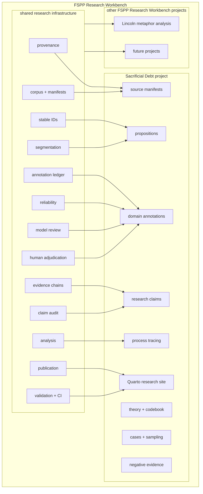
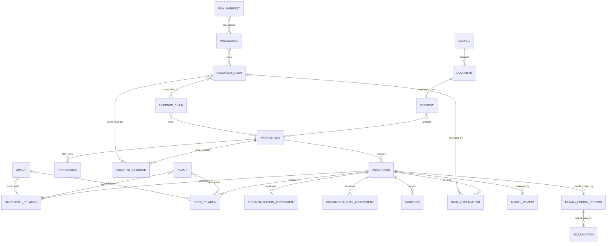
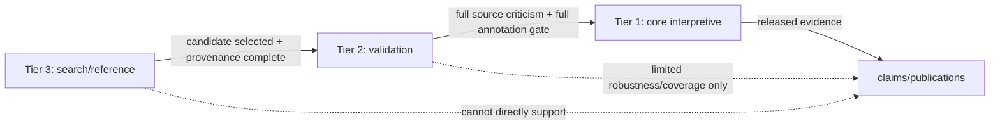
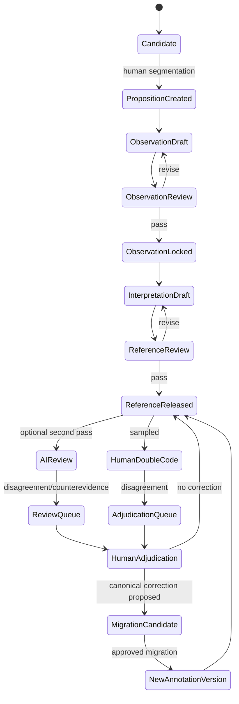
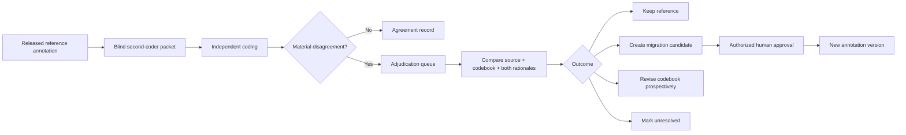
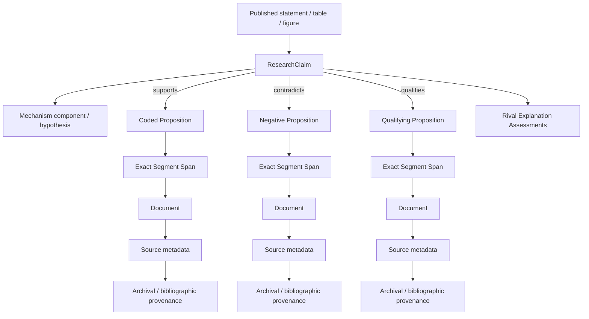
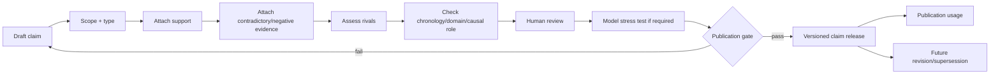
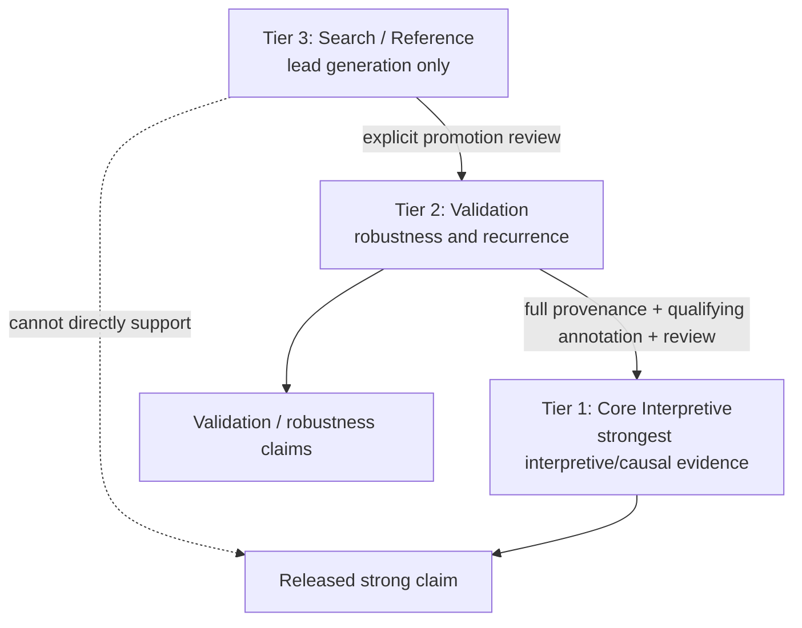

# Sacrificial Debt Workbench
## Technical and Research Design Specification

**Project:** *Sacrificial Debt: How Unequal Suffering Turns Survival into Political Guilt*  
**Workbench:** Sacrificial Debt Workbench  
**Status:** Proposed architecture and implementation specification  
**Date:** 20 August 2026  
**Research authority:** *FSPP Sacrificial Debt Research Program Prospectus v0.2*  
**Reference implementation:** `lincoln-metaphor-analysis` repository supplied with this design request  

---

## Design authority and interpretation rule

This specification treats the **Sacrificial Debt Research Program Prospectus v0.2 as authoritative for substantive research design**. Engineering decisions are proposed only where the prospectus leaves implementation unspecified. Where the design prompt and prospectus differ, this specification preserves the prospectus and explicitly records the discrepancy as an open research-engineering decision rather than silently changing the theory.

The supplied `lincoln-metaphor-analysis` repository is treated as a **methodological and architectural precedent**, not a schema template. The design reuses its strongest patterns—stable identifiers, corpus stratification, provenance validation, derivative evidence chains, separate AI/human reliability layers, adjudication immutability, controlled analysis, claim audit, generated-output freshness checks, Quarto publication, and release gates—while rejecting metaphor-specific fields and Lincoln-specific periodization.

The design philosophy is:

> **auditability over convenience; interpretability over automation; stable evidence over clever extraction; explicit uncertainty over false precision; reproducibility over one-off analysis; human judgment over black-box inference; falsifiability over confirmation; scholarly provenance over data volume.**

---

# 1. Executive Summary

The Sacrificial Debt Workbench should be implemented as a **project module inside a broader FSPP Research Workbench monorepo**, with a small set of rigorously defined shared research-infrastructure packages and a project-local domain layer. This architecture is preferable to a standalone repository because the Lincoln reference repository itself has already evolved toward a shared FSPP Research Workbench, and because the reusable portions of Lincoln are infrastructure concerns rather than Lincoln-specific interpretation.

The Workbench is not a database wrapped around an eventual paper. It is the **primary research environment** through which source acquisition, provenance, segmentation, manual annotation, interpretation, falsification, reliability testing, process tracing, claim audit, controlled analysis, and publication are performed. Publications are snapshots of a versioned evidence system.

The core methodological safeguard is a strict separation between **identification and interpretation**. A proposition first receives observable textual coding: who is speaking, who is represented as sacrificing, what is surrendered, who is represented as spared, whether comparison is explicit, and how sacrifice/survival are valued. Only after that layer is locked may the researcher code sacrificial accounting, essentialization, dischargeability, sanction, causal role, rival explanations, and negative evidence. AI review cannot create or overwrite the reference annotation layer.

The canonical data store should be **versioned JSONL plus immutable source files**, validated by Pydantic/JSON Schema. A **generated DuckDB database** and **Parquet analytical snapshots** should support queries and analysis but should never become the sole source of truth. This keeps records inspectable in Git while allowing efficient comparative analysis. Source binaries that cannot legally or practically be committed should be represented by manifests, checksums, archive citations, and local/external storage references.

The principal interpretive unit is the **proposition**, not the sentence. Sentences remain stable source coordinates, but propositions may span part of one sentence or several sentences. Once released, identifiers are never silently renumbered. Splits, merges, corrections, and resegmentation create supersession relationships instead of destructive edits.

The Workbench should represent coercion and sacrificial meaning as **independent dimensions**. Coercive severity should be derived primarily from coded sanction records. Sacrificial-debt framing should be derived from structured fields rather than manually forced into a single score. Prospectus v0.2 defines framing levels 0–5; the design prompt proposes a possible level 6 for restorative/equalizing suffering. This specification therefore preserves the prospectus's 0–5 derived scale and stores `equalization_claim` independently. A 0–6 scale can be introduced only by a versioned codebook decision.

The MVP should be manual-first. It should support Tier 1 pilot sources for Germany and small matched contrast samples for Britain, Australia, and France; proposition-level annotation; negative evidence; rival explanations; original/translation pairing; limited human reliability; evidence chains; claim audit; controlled descriptive outputs; and a Quarto/static site. It should **not** depend on large-scale LLM extraction, embeddings, knowledge graphs, microservices, or a hosted application.

---

# 2. Research and System Goals

The Workbench shall:

1. Operationalize the prospectus without changing its substantive theory by software convenience.
2. Make every interpretive claim traceable to exact source coordinates and provenance.
3. Make negative and falsifying evidence as easy to register, query, and publish as confirming evidence.
4. Preserve the distinction between rhetoric/ideological production, reception, and policy/implementation.
5. Preserve the distinction between sacrificial asymmetry and sacrificial debt.
6. Preserve the distinction between behavioral accusation and essentialized/ontological accusation.
7. Preserve the distinction between legitimation and policy causation.
8. Support within-case process tracing and structured, focused cross-case comparison.
9. Support three corpus tiers with explicit evidentiary permissions and promotion gates.
10. Preserve original-language evidence alongside translations for high-value claims.
11. Provide field-specific reliability diagnostics instead of a single universal score.
12. Treat AI/model output as review evidence rather than authoritative coding.
13. Preserve all coder/model/adjudication decisions as an audit trail.
14. Produce reproducible tables, timelines, matrices, concordances, and evidence dashboards.
15. Support multiple scholarly outputs from one shared evidence environment.
16. Make the project capable of narrowing, revising, or rejecting the Sacrificial Debt theory.
17. Provide shared infrastructure that can be reused by other Political Pathology projects.

---

# 3. Non-Goals

The Workbench is not intended to:

- prove Koenigsberg's interpretation of Hitler;
- prove the Sacrificial Debt theory;
- treat the Holocaust as the definition of sacrificial debt;
- treat genocide as a scalar continuation of ordinary military sacrifice;
- infer audience reception from speeches alone;
- infer policy causation from propaganda alone;
- infer sacrificial motivation from policy occurrence alone;
- replace close reading, source criticism, or historical judgment with NLP/LLMs;
- create a comprehensive archive of all relevant historical materials in the MVP;
- make raw frequency comparisons across unequal corpora appear causal;
- build a high-throughput SaaS platform;
- require cloud infrastructure, microservices, message queues, or a hosted database;
- clone Lincoln's CMT/MIPVU/Koenigsberg metaphor schema;
- use model consensus as a proxy for truth;
- silently rewrite released annotations when a codebook changes;
- redistribute copyrighted source material merely because it was used for analysis.

---

# 4. Research Requirements Derived from the Prospectus

## 4.1 Central question

The system must support the central research question: **under what conditions does perceived exemption from collective sacrifice become an unpayable political debt that legitimates coercive suffering or death of the allegedly nonsacrificing group?**

## 4.2 Required conceptual distinctions

The data model must keep these distinct:

- collective sacred object;
- sacrificial demand;
- offering;
- sacrifice;
- sacrificial asymmetry;
- sacrificial creditor;
- sacrificial debtor;
- sacrificial debt;
- sacrificial essentialization;
- unpayable debt / non-dischargeability;
- coercive sacrificial equalization;
- exterminatory closure.

## 4.3 Mechanism representation

The four mechanism modules must be represented without presuming that every case completes them:

- **Module A — Sacrificial mobilization**;
- **Module B — Asymmetry and moral comparison**;
- **Module C — Essentialization and political activation**;
- **Module D — Coercive equalization and closure**.

Each coded item may support, contradict, qualify, or be irrelevant to one or more mechanism components. The system must allow pathways to stop, reverse, branch, or be absent.

## 4.4 Minimum debt-evidence rule

A strong claim of sacrificial debt requires all three prospectus elements:

- **A:** identifiable prior/ongoing sacrifice;
- **B:** explicit comparison with a less-sacrificing, spared, or benefiting actor;
- **C:** normative implication that the second actor owes, deserves less, must contribute, or may legitimately be sanctioned.

Validators should prevent a researcher from marking `debt_status=emic` or `evidence_strength=strong` while the minimum required components are absent unless an explicit override record and rationale exist.

## 4.5 Emic/etic boundary

`emic`, `etic`, `mixed`, and `absent` must be explicit values. Etic reconstruction may never be presented in generated outputs as actor-stated debt language.

## 4.6 Falsification

F1–F7 from the prospectus must be represented as first-class `FalsificationTest` records linked to negative evidence, claims, hypotheses, cases, and publications. A project release should report the current status of each falsification test (`untested`, `supported_disconfirmation`, `mixed`, `not_observed`, `inconclusive`).

## 4.7 Case functions

Case role is data, not prose only:

| Case | Methodological role |
|---|---|
| Germany | mechanism discovery / intensive process tracing |
| Britain | individualized stigma and social coercion contrast |
| Australia | explicit equality-of-sacrifice contrast |
| France | republican burden-sharing / blood-tax contrast |

The system must not imply that these are symmetrical controls.

## 4.8 Manual-first gate

The workflow must enforce:

`manual pilot -> codebook stabilization -> reliability -> limited retrieval -> validation against human coding -> expansion`.

Automation is unavailable for production extraction until the project marks the appropriate gate as passed.

---

# 5. Lessons and Reusable Patterns from Lincoln Metaphor Analysis

## 5.1 Reusable patterns

The supplied Lincoln repository demonstrates several strong, directly reusable patterns:

1. **Corpus tiers with evidentiary permissions.** Tier 1 is fully interpretable, Tier 2 validates robustness, and Tier 3 is search-only; search hits are not evidence.
2. **Stable identifier preservation.** The v4 expansion preserves earlier document and sentence IDs rather than renumbering them.
3. **Provenance as executable validation.** Source authority, source URL, edition notes, text status, authorship status, and provenance records are schema-validated.
4. **Derivative evidence chains.** Reviewer-facing audit records are generated from canonical annotations rather than maintained manually in parallel.
5. **Controlled analysis.** Lincoln separates raw counts from register/authorship-controlled outputs and explicitly warns that raw counts are descriptive.
6. **Textual-variant apparatus.** Source risks are separately registered and attached to affected claims rather than buried in notes.
7. **Reception evidence boundary.** Lincoln explicitly prevents author rhetoric from being treated as reception evidence.
8. **Separate AI/model and human reliability layers.** Model agreement, human-human reliability, and human-vs-reference comparison are not averaged together.
9. **Blind packets.** Review packets exclude reference answers, synthesis claims, and adjudication outcomes.
10. **Adjudication immutability.** Human/model review layers generate correction candidates but cannot silently mutate canonical annotations.
11. **Write guards.** Scripts enforce which directories a review stage can modify.
12. **Generated-output freshness checks.** Deterministic artifacts can be regenerated and CI fails when tracked generated outputs drift.
13. **Publication gate.** Validation, tests, pipeline generation, freshness checks, and Quarto rendering all precede deployment.
14. **Release checklists.** Publication status is explicit; designed-but-not-executed reliability cannot be presented as completed.
15. **Site as scholarly interface.** Quarto exposes method, corpus, analysis, findings, limitations, and audit paths without making the repository itself the only interface.

## 5.2 Patterns that should not be copied

The following are Lincoln-specific or accidental implementation choices:

- sentence-centered metaphor instances as the principal interpretive unit;
- MIPVU lexical-unit fields;
- CMT source/target-domain mappings and six Lincoln metaphor clusters;
- Lincoln-specific `fantasy_type`, `violence_logic`, and absence flags;
- Lincoln phase and genre enumerations;
- LCC metaphor benchmark infrastructure;
- Lincoln-specific source-authority hierarchy;
- its historical Node.js/Python split as a mandatory architecture;
- v1 migration compatibility fields that exist only to preserve older Lincoln releases.

## 5.3 Direct design consequence

Sacrificial Debt should inherit **the pipeline discipline**, not the metaphor ontology. The shared workbench should expose generic provenance, corpus, annotation-ledger, reliability, evidence-chain, audit, analysis, and publication primitives; Sacrificial Debt supplies its own proposition-centered theory schemas and controlled vocabularies.

---

# 6. Proposed System Architecture

## 6.1 Architecture decision

**Recommended:** FSPP Research Workbench monorepo with shared research infrastructure and a project-local Sacrificial Debt module.



## 6.2 Why monorepo

Advantages:

- shared validation and provenance rules can be tested once;
- claim-audit/evidence-chain logic is inherently cross-project infrastructure;
- stable versioned shared packages can be released with project snapshots;
- fewer duplicated scripts and CI workflows;
- migration of Lincoln into shared infrastructure has already been conceptually anticipated by the supplied repository;
- future Foundation projects can reuse the same scholarly controls.

Risks:

- a shared package change could affect multiple projects;
- project-specific theory may leak into shared code;
- releases require explicit compatibility boundaries.

Mitigation: semantic version shared schemas/packages; project-local extension schemas; project release manifests pin shared package versions.

## 6.3 High-level component rule

The shared layer should know **how to register evidence**, not **what Sacrificial Debt means**. For example, shared code may validate an annotation record with a project schema reference, but only `projects/sacrificial-debt/` defines `essentialization_status` values.

---

# 7. Repository Strategy

## 7.1 Monorepo versus standalone

| Criterion | Standalone | FSPP Research Workbench monorepo | Recommendation |
|---|---|---|---|
| Scholarly independence | strong | strong if project releases are pinned | monorepo |
| Shared provenance/audit | duplicated | reusable | monorepo |
| Portability | simple repo copy | exportable project package needed | monorepo with export command |
| Maintenance | duplicated CI/scripts | centralized | monorepo |
| Versioning | simple | requires compatibility discipline | monorepo |
| Risk of theory coupling | lower | must be actively prevented | monorepo with extension boundary |
| Reproducibility | good | better if release manifest pins shared commit | monorepo |

## 7.2 Scholarly independence requirement

Every Sacrificial Debt release must be reproducible from:

- one FSPP Research Workbench Git commit/tag;
- one Sacrificial Debt project release manifest;
- one source/corpus manifest set;
- one schema/codebook version set;
- one environment lock;
- one publication snapshot.

A future scholar must not need the latest state of unrelated FSPP Research Workbench projects.

## 7.3 Exportability

Provide `fspp project export sacrificial-debt --release <tag>` to assemble a read-only release bundle containing project data, shared schemas used by that release, codebook, run manifests, notebooks/scripts, and generated publication artifacts.

---

# 8. Directory Structure

```text
fspp-research-workbench/
├── pyproject.toml
├── uv.lock
├── README.md
├── .github/workflows/
│   ├── validate.yml
│   └── publish.yml
├── src/
│   └── fspp_workbench/
│       ├── core/
│       ├── validation/
│       ├── schema.py
│       └── projects/
│           └── sacrificial_debt/
├── schemas/
│   ├── source.schema.json
│   ├── document.schema.json
│   ├── segment.schema.json
│   ├── evidence-chain.schema.json
│   └── run-manifest.schema.json
├── publication/
│   ├── _quarto.yml
│   ├── index.qmd
│   └── projects/
│       └── sacrificial-debt/
│           ├── index.qmd
│           ├── methods/
│           ├── corpus/
│           ├── evidence/
│           ├── findings/
│           └── limitations/
└── projects/
    └── sacrificial-debt/
        ├── README.md
        ├── project.toml
        ├── research/
        │   ├── research-question.md
        │   ├── concepts.md
        │   ├── mechanism.md
        │   ├── hypotheses.md
        │   ├── falsification.md
        │   └── ethics.md
        ├── codebook/
        │   ├── codebook.md
        │   ├── examples/
        │   ├── decision-log.md
        │   └── vocabularies/
        ├── schemas/
        │   ├── annotation.schema.json
        │   ├── sacrificial-relation.schema.json
        │   ├── debt-relation.schema.json
        │   ├── negative-evidence.schema.json
        │   └── claim.schema.json
        ├── corpus/
        │   ├── manifests/
        │   ├── provenance/
        │   ├── raw/                 # only redistributable/local permitted files
        │   ├── normalized/
        │   ├── segmented/
        │   └── tiers/
        ├── data/
        │   ├── sources.jsonl
        │   ├── documents.jsonl
        │   ├── segments.jsonl
        │   ├── propositions.jsonl
        │   ├── annotations/
        │   │   ├── reference.jsonl
        │   │   ├── model-review.jsonl
        │   │   ├── human-coding.jsonl
        │   │   └── adjudication.jsonl
        │   ├── negative-evidence.jsonl
        │   ├── claims.jsonl
        │   ├── evidence-chains.jsonl
        │   └── reliability/
        ├── cases/
        │   ├── germany/
        │   ├── britain/
        │   ├── australia/
        │   └── france/
        ├── analysis/
        │   ├── queries/
        │   ├── process-tracing/
        │   ├── comparative/
        │   ├── robustness/
        │   └── notebooks/
        ├── generated/
        │   ├── duckdb/
        │   ├── parquet/
        │   ├── tables/
        │   ├── figures/
        │   ├── audits/
        │   └── run-manifests/
        └── tests/
            ├── fixtures/
            ├── schemas/
            ├── validation/
            ├── pipeline/
            └── acceptance/
```

---

# 9. Data Architecture

## 9.1 Canonical versus generated data

**Canonical, version-controlled:**

- source/provenance metadata;
- text-normalization manifests;
- stable segmentation registries;
- propositions;
- reference human annotations;
- negative evidence;
- rival-explanation assessments;
- model/human review submissions;
- adjudication decisions;
- research claims;
- codebook decisions;
- publication metadata.

**Generated/rebuildable:**

- DuckDB database;
- Parquet analytical tables;
- concordances;
- derived outcome levels;
- reliability summaries;
- evidence-chain projections;
- claim-audit reports;
- figures/tables;
- Quarto HTML.

Generated artifacts must carry a `RunManifest` and source hashes.

## 9.2 Storage choices

- **JSONL:** canonical entity records; inspectable diffs; append-friendly.
- **YAML/TOML:** project configuration and controlled vocabulary metadata where human editing dominates.
- **CSV/TSV:** human coding packets and simple exchange only; not canonical for nested records.
- **Parquet:** generated analytical snapshots and larger Tier 2/3 retrieval features.
- **DuckDB:** generated local query/analysis database; never authoritative.
- **SQLite:** not required for MVP. Consider only if a local annotation UI later needs transactional workflow state.
- **Graph database:** not required. Evidence chains are naturally representable as relational edge tables/JSONL and can be projected to a graph when needed.

## 9.3 Relational normalization

The domain is relational even though canonical files are JSONL. Actors, groups, propositions, claims, sanctions, and relations should have stable IDs and be referenced rather than duplicated. Human-readable denormalized projections are generated for review.

---

# 10. Entity-Relationship Model



### Normalization principle

A proposition is a textual object. An annotation is a research judgment about that proposition under a particular codebook version. Relations and assessments are separate records so that one proposition can contain multiple sacrificial actors, multiple debtor relations, multiple sanctions, or competing interpretations without flattening them into one oversized row.


# 11. Stable Identifier Scheme

## 11.1 Identifier policy

IDs are assigned once and persist permanently. Ordinal position is metadata, not identity. Released IDs are never recomputed from current ordering.

Recommended human-readable forms:

| Entity | Format | Example |
|---|---|---|
| Source | `sd-src-######` | `sd-src-000001` |
| Document | `sd-doc-######` | `sd-doc-000001` |
| Page segment | `sd-seg-######` + `segment_type=page` | `sd-seg-000101` |
| Paragraph | `sd-seg-######` + `segment_type=paragraph` | `sd-seg-000154` |
| Sentence | `sd-seg-######` + `segment_type=sentence` | `sd-seg-000155` |
| Proposition | `sd-prop-######` | `sd-prop-000001` |
| Annotation | `sd-ann-######` | `sd-ann-000001` |
| Actor | `sd-act-######` | `sd-act-000001` |
| Group | `sd-grp-######` | `sd-grp-000001` |
| Claim | `sd-clm-######` | `sd-clm-000001` |
| Evidence chain | `sd-evc-######` | `sd-evc-000001` |
| Negative evidence | `sd-neg-######` | `sd-neg-000001` |
| Adjudication | `sd-adj-######` | `sd-adj-000001` |
| Publication | `sd-pub-######` | `sd-pub-000001` |
| Run | `sd-run-YYYYMMDD-######` | `sd-run-20260820-000001` |

## 11.2 Why not location-derived IDs

A sentence ID such as `doc_001_p03_s02` is convenient but can become unstable when a transcription is corrected. Lincoln mitigates this by preserving prior numbering, but Sacrificial Debt should go one step further: **identity and order are separate**. Each segment receives an immutable registry ID; `document_order`, `page_label`, `paragraph_order`, and `sentence_order` can change only through versioned segmentation events.

## 11.3 Source-coordinate anchors

Every proposition stores:

- `document_id`;
- one or more `segment_id` anchors;
- exact normalized character offsets;
- exact quoted span text;
- source-page/folio coordinates where known;
- normalized text hash;
- source text hash/version.

## 11.4 Lifecycle

Statuses:

`active | deprecated | superseded | withdrawn | merged | split`.

Rules:

- **Correction:** old record remains; new version linked via `supersedes_id`.
- **Split:** old proposition becomes `split`; child propositions list `derived_from=[old_id]`.
- **Merge:** component propositions remain; merged proposition lists all parents.
- **Resegmentation:** prior segment IDs remain resolvable; new segment version becomes current.
- **Publication lock:** any ID cited by a release remains resolvable forever through a release registry.

---

# 12. Corpus-Tier Model



## 12.1 Tier 1 — Core interpretive corpus

Purpose: full manual annotation, high-value process tracing, strongest descriptive/interpretive/causal claims.

Required gates:

- source provenance complete;
- source authority/reliability assessed;
- text normalized and checksummed;
- stable segments/propositions assigned;
- original-language preservation where relevant;
- full reference annotation completed;
- negative-evidence search logged;
- relevant reliability status visible;
- claim linkage permitted.

## 12.2 Tier 2 — Validation corpus

Purpose: recurrence, robustness, selection bias, negative findings, broader coverage.

Permitted outputs:

- coverage tables;
- matched comparison checks;
- light presence/absence screening;
- retrieval validation;
- selection-bias diagnostics;
- promotion candidates.

Tier 2 does not automatically inherit Tier 1 interpretive weight.

## 12.3 Tier 3 — Search/reference corpus

Purpose: discovery, lexical search, chronology, context, negative searches.

A Tier 3 hit is a lead. It must pass promotion gates before becoming coded evidence.

## 12.4 Promotion records

Every promotion creates a `CorpusPromotion` record containing:

- source/document ID;
- from tier;
- to tier;
- rationale;
- research question served;
- selection criteria satisfied;
- reviewer;
- date;
- source/provenance gate result;
- annotation burden created;
- sampling impact note.

This makes corpus growth auditable and prevents opportunistic quotation collection.

---

# 13. Source Acquisition and Provenance

## 13.1 Source acquisition sequence


## 13.2 Provenance requirements

Every source/document shall record, where applicable:

- stable IDs;
- full archival citation;
- bibliographic citation;
- canonical URL;
- archive/repository;
- collection/series/box/folder/item;
- edition/editor;
- publication/creation date and precision;
- acquisition date;
- local path or external-storage locator;
- SHA-256 checksum;
- MIME/type;
- language;
- transcription method;
- OCR status if relevant;
- copyright/redistribution status;
- source authority level;
- source reliability assessment;
- known textual variants;
- provenance notes.

## 13.3 Source authority register

Reuse Lincoln's source-authority-register pattern, generalized:

`preferred_scholarly_edition | official_archive | contemporary_print | critical_secondary_transcription | reputable_digital_archive | derivative_transcription | unverified`.

Authority level is not truth; it governs review burden and publication caveats.

## 13.4 Copyright rule

A source can be fully represented in metadata and analysis even when the text cannot be redistributed. The release bundle may include only:

- metadata;
- short legally permissible excerpts;
- checksums;
- archive locators;
- researcher-created annotations;
- derived analytical features as allowed.

---

# 14. Text Normalization and Segmentation

## 14.1 Immutable acquisition versus normalized copy

Never modify acquired raw source files in place. Normalization produces a separate artifact with a transformation manifest.

## 14.2 Normalization operations

Permitted, logged operations may include:

- Unicode normalization;
- line-ending normalization;
- dehyphenation only when rule-based and reviewable;
- boilerplate removal;
- page/folio marker preservation;
- whitespace normalization;
- typographic quote normalization only if original retained;
- OCR correction as a separate reviewed layer.

Every transformation records tool version, parameters, and before/after checksum.

## 14.3 Segmentation hierarchy

`Document -> page/folio -> paragraph/block -> sentence -> proposition`.

Sentence segmentation is structural; proposition segmentation is interpretive and human-directed.

## 14.4 Proposition rules

A proposition should be the smallest meaningful span that preserves:

- actor/speaker;
- represented sacrificer;
- alleged survivor/nonsacrificer;
- comparison;
- obligation/sanction when present;
- context needed to avoid distorted quotation.

A proposition may span multiple sentences. Its exact anchor must remain resolvable to source coordinates.

## 14.5 Context windows

Every proposition also stores `context_before_segment_ids` and `context_after_segment_ids` or a deterministic context-window rule. Publication excerpts should display enough context to prevent decontextualized perpetrator quotation.

---

# 15. Translation and Textual-Variant Handling

## 15.1 Translation objects

Translations are separate records, not replacements for the original text.

Statuses:

`published_translation | researcher_translation | machine_assisted_researcher_reviewed | machine_unverified | none_needed`.

For the MVP, machine-unverified translations may support search but may not support a high-strength claim.

## 15.2 Required translation metadata

- original proposition ID;
- source language;
- target language;
- translator;
- translation source/edition;
- translation date;
- contested terms;
- lexical ambiguity note;
- translation-risk flag;
- reviewer;
- translation status.

## 15.3 High-value claim rule

If a claim depends materially on translated evidence, the evidence chain must preserve the original-language proposition and translation metadata. A claim-audit page should display original and translation side-by-side where rights permit.

## 15.4 Textual variants

Reuse Lincoln's textual-variant-apparatus principle. A `TextualVariantAssessment` links source risks to affected proposition and claim IDs. It can state that a claim is safe at a broad conceptual level but unsafe if it depends on one disputed word.

---

# 16. Annotation Architecture

## 16.1 Layered annotation model

The Workbench implements the prompt's identification/interpretation separation as explicit stages:

### Layer A — Observable textual structure

Human coders identify:

- collective object;
- sacrificer;
- sacrifice type;
- alleged survivor/nonsacrificer;
- explicit comparison;
- moral valuation of sacrifice;
- moral valuation of survival;
- actor;
- audience;
- date;
- source/evidence domain.

### Layer B — Sacrificial accounting

Separately code:

- asymmetry;
- creditor;
- debtor;
- reciprocal obligation;
- debt language;
- repayment language;
- equalization claim;
- emic/etic debt status.

### Layer C — Essentialization and dischargeability

Separately code:

- behavioral accusation;
- group-generalized accusation;
- racial/ontological accusation;
- essentialization status;
- dischargeability status.

### Layer D — Political consequence

Sanction records capture stigma through exterminatory policy without collapsing meaning and severity.

### Layer E — Causal role

Causal-role assessment is separate from content identification.

### Layer F — Rival explanations

Multiple rival explanations may coexist and are never overwritten by a selected “winner.”

### Layer G — Negative/falsifying evidence

Negative evidence is independently stored and queryable.

## 16.2 Locking rule

A reference annotation moves through:

`observation_draft -> observation_reviewed -> observation_locked -> interpretation_draft -> reference_reviewed -> released`.

Interpretive fields are not writable until `observation_locked` except in a sandbox draft that cannot enter analysis.

---

# 17. Detailed Annotation Schemas

The following schemas are conceptual contracts. Implementation should generate JSON Schema from Pydantic models where practical and keep checked-in JSON Schema copies for language-independent validation.

## 17.1 Source

| Field | Type | Req. | Values / rule | Example |
|---|---|---:|---|---|
| `source_id` | string | yes | stable ID | `sd-src-000001` |
| `title` | string | yes | non-empty | `Example source title` |
| `source_kind` | enum | yes | archival_item, book, periodical, speech_record, diary, letter, policy_record, etc. | `archival_item` |
| `archive_repository` | string | no | free text | `Example Archive` |
| `archival_citation` | string | no | full citation | `Collection X, box Y...` |
| `bibliographic_citation` | string | no | full citation | `Author, Title...` |
| `canonical_url` | URI | no | canonical locator | `https://example.invalid/item` |
| `edition` | string | no | edition/editor | `critical edition` |
| `creation_date` | date/range | no | ISO + precision | `1916-10-01` |
| `acquisition_date` | date | yes | ISO | `2026-08-20` |
| `language` | BCP-47 | yes | language code | `de` |
| `checksum_sha256` | string | yes* | required when file acquired | `abc...` |
| `rights_status` | enum | yes | public_domain, licensed, restricted, unknown | `restricted` |
| `redistribution_status` | enum | yes | allowed, excerpt_only, metadata_only, unknown | `metadata_only` |
| `authority_level` | enum | yes | preferred...unverified | `official_archive` |
| `reliability_note` | string | yes | source criticism | `Official record; editorial mediation noted.` |
| `provenance_notes` | string | no | free text | `...` |
| `status` | enum | yes | active, deprecated, superseded | `active` |

## 17.2 Document

| Field | Type | Req. | Values / rule | Example |
|---|---|---:|---|---|
| `document_id` | string | yes | stable ID | `sd-doc-000001` |
| `source_id` | FK | yes | Source | `sd-src-000001` |
| `case_id` | FK | yes | Case | `sd-case-germany` |
| `title` | string | yes | non-empty | `Example document` |
| `date_start/end` | date | no | ISO | `1916-10-01` |
| `date_precision` | enum | yes | exact, month, year, approximate, uncertain | `exact` |
| `actor_ids` | array FK | no | Actor(s) | `[sd-act-000001]` |
| `institution_ids` | array FK | no | Actor/institution | `[]` |
| `audience` | enum/string | no | controlled + extension | `public` |
| `source_type` | enum | yes | speech, policy, diary, letter, press, etc. | `speech` |
| `register` | enum | yes | public, private, administrative, propaganda, etc. | `public` |
| `evidence_domain` | enum | yes | rhetoric, reception, policy | `rhetoric` |
| `corpus_tier` | enum | yes | tier1, tier2, tier3 | `tier1` |
| `text_status` | enum | yes | complete, excerpt, fragment, uncertain | `complete` |
| `selection_rationale` | string | yes | explicit | `Mechanism-discovery source family.` |
| `source_reliability` | enum | yes | high, medium, low, disputed | `high` |
| `status` | enum | yes | active... | `active` |

## 17.3 Segment

| Field | Type | Req. | Values / rule | Example |
|---|---|---:|---|---|
| `segment_id` | string | yes | stable | `sd-seg-000155` |
| `document_id` | FK | yes | Document | `sd-doc-000001` |
| `parent_segment_id` | FK | no | Segment | `sd-seg-000154` |
| `segment_type` | enum | yes | page, folio, block, paragraph, sentence | `sentence` |
| `order_index` | int | yes | >=1 | `12` |
| `page_label` | string | no | source page/folio | `p. 4` |
| `text` | string | yes | normalized text | `[source sentence]` |
| `char_start/end` | int | yes | document-normalized offsets | `203 / 287` |
| `text_hash` | SHA-256 | yes | deterministic | `...` |
| `segmentation_version` | semver | yes | | `1.0.0` |
| `status` | enum | yes | active, superseded, split, merged | `active` |

## 17.4 Proposition

| Field | Type | Req. | Values / rule | Example |
|---|---|---:|---|---|
| `proposition_id` | string | yes | stable | `sd-prop-000001` |
| `document_id` | FK | yes | Document | `sd-doc-000001` |
| `anchor_segment_ids` | array FK | yes | 1+ segments | `[sd-seg-000155]` |
| `span_start/end` | int | yes | exact normalized offsets | `220 / 260` |
| `span_text` | string | yes | exact quote | `[example span]` |
| `context_segment_ids` | array FK | yes | review context | `[...]` |
| `proposition_type` | enum | yes | assertion, comparison, demand, justification, description, other | `comparison` |
| `created_by` | string | yes | human/system | `researcher_1` |
| `created_at` | datetime | yes | ISO | `2026-08-20T20:00:00-04:00` |
| `segmentation_version` | semver | yes | | `1.0.0` |
| `status` | enum | yes | active... | `active` |

## 17.5 Annotation

| Field | Type | Req. | Values / rule | Example |
|---|---|---:|---|---|
| `annotation_id` | string | yes | stable | `sd-ann-000001` |
| `proposition_id` | FK | yes | Proposition | `sd-prop-000001` |
| `annotation_kind` | enum | yes | reference, coder, model, adjudicated | `reference` |
| `state` | enum | yes | workflow state | `observation_locked` |
| `actor_ids` | array FK | no | represented actors | `[]` |
| `collective_object` | controlled string | no | nation, state, people, etc. + other | `nation` |
| `sacrificer_ids` | array FK | no | Actor/Group | `[]` |
| `sacrifice_types` | array enum | no | death, injury, service, food, property, labor, family, freedom, time, other | `[military_service]` |
| `alleged_survivor_ids` | array FK | no | Actor/Group | `[]` |
| `explicit_comparison` | enum | yes | yes, no, uncertain | `yes` |
| `moral_value_sacrifice` | multilabel | no | codebook values | `[duty]` |
| `moral_value_survival` | multilabel | no | codebook values | `[undeserved]` |
| `audience_id/text` | FK/string | no | | `public` |
| `evidence_domain` | enum | yes | rhetoric, reception, policy | `rhetoric` |
| `coder_id` | string | yes | pseudonymous/project ID | `coder_ref_01` |
| `codebook_version` | semver | yes | | `0.2.0` |
| `confidence` | decimal | no | 0–1 + band | `0.85` |
| `uncertainty_note` | string | no | | `...` |
| `created_at` | datetime | yes | | `...` |

## 17.6 Actor

| Field | Type | Req. | Values / rule | Example |
|---|---|---:|---|---|
| `actor_id` | string | yes | stable | `sd-act-000001` |
| `display_name` | string | yes | | `Example actor` |
| `actor_type` | enum | yes | person, institution, organization, office, publication, collective_symbol | `person` |
| `case_ids` | array FK | no | | `[sd-case-germany]` |
| `aliases` | array | no | | `[]` |
| `authority_role` | string | no | historical role, not interpretation | `...` |
| `notes` | string | no | | `...` |

## 17.7 Group

| Field | Type | Req. | Values / rule | Example |
|---|---|---:|---|---|
| `group_id` | string | yes | stable | `sd-grp-000001` |
| `display_name` | string | yes | actor/source label or scholarly label | `Example group` |
| `group_type` | enum | yes | military, ethnic, religious, civic, class, occupational, political, symbolic, other | `civic` |
| `emic_label` | string | no | source term | `...` |
| `etic_label` | string | no | researcher normalization | `...` |
| `label_risk_note` | string | no | essentializing/offensive terminology note | `...` |
| `case_ids` | array FK | no | | `[]` |

## 17.8 SacrificialRelation

| Field | Type | Req. | Values / rule | Example |
|---|---|---:|---|---|
| `sacrificial_relation_id` | string | yes | stable | `sd-sr-000001` |
| `annotation_id` | FK | yes | Annotation | `sd-ann-000001` |
| `collective_object` | string/FK | yes | | `nation` |
| `sacrificer_refs` | array | yes | Actor/Group refs | `[...]` |
| `offering_type` | enum | yes | voluntary, socially_compelled, legally_compelled, coerced, unclear | `legally_compelled` |
| `sacrifice_type` | enum/multilabel | yes | controlled | `military_service` |
| `sacrifice_present` | enum | yes | explicit, implied, absent, uncertain | `explicit` |
| `sacrifice_valence` | multilabel | no | sacred, heroic, duty, necessary, proof_of_worth, tragic, futile, other | `[duty]` |
| `asymmetry_present` | enum | yes | yes, no, uncertain | `yes` |
| `asymmetry_basis` | multilabel | no | risk, death, injury, deprivation, labor, property, survival, profit, other | `[risk]` |
| `emic_or_etic` | enum | yes | emic, etic, mixed | `emic` |

## 17.9 DebtRelation

| Field | Type | Req. | Values / rule | Example |
|---|---|---:|---|---|
| `debt_relation_id` | string | yes | stable | `sd-dr-000001` |
| `annotation_id` | FK | yes | | `sd-ann-000001` |
| `creditor_refs` | array FK | yes | Actor/Group/symbolic constituency | `[...]` |
| `debtor_refs` | array FK | yes | Actor/Group | `[...]` |
| `debt_status` | enum | yes | emic, etic, mixed, absent | `emic` |
| `reciprocal_obligation` | enum | yes | explicit, implied, absent, uncertain | `explicit` |
| `debt_language_terms` | array string | no | source terms | `["..."]` |
| `repayment_language_terms` | array string | no | source terms | `[]` |
| `owed_object` | multilabel | no | service, contribution, deprivation, suffering, protection_loss, labor, property, life, other | `[contribution]` |
| `equalization_claim` | enum | yes | explicit, implied, absent, uncertain | `absent` |
| `minimum_rule_A/B/C` | booleans | yes | evidentiary components | `true/true/true` |
| `validation_override_id` | FK | no | required if strong coding violates rule | null |

## 17.10 EssentializationAssessment

| Field | Type | Req. | Values / rule | Example |
|---|---|---:|---|---|
| `essentialization_id` | string | yes | | `sd-ess-000001` |
| `annotation_id` | FK | yes | | `sd-ann-000001` |
| `accusation_scope` | enum | yes | individual_behavior, group_generalized, racial_ontological, other_ontological, unclear, none | `group_generalized` |
| `counterexample_handling` | enum | no | accepted, exception_only, denied, irrelevant, not_observed | `exception_only` |
| `identity_language` | array | no | terms/spans | `[]` |
| `evidence_note` | string | yes | | `...` |

## 17.11 DischargeabilityAssessment

| Field | Type | Req. | Values / rule | Example |
|---|---|---:|---|---|
| `dischargeability_id` | string | yes | | `sd-dis-000001` |
| `annotation_id` | FK | yes | | `sd-ann-000001` |
| `status` | enum | yes | dischargeable, contested, non_dischargeable, unclear, not_applicable | `contested` |
| `proffered_discharge` | multilabel | no | service, veteran_status, loyalty, contribution, deprivation, other | `[service]` |
| `discharge_effect` | enum | no | clears, partially_clears, fails, worsens, unknown | `fails` |
| `counterevidence_refs` | array FK | no | propositions | `[]` |
| `rationale` | string | yes | | `...` |

## 17.12 Sanction

| Field | Type | Req. | Values / rule | Example |
|---|---|---:|---|---|
| `sanction_id` | string | yes | | `sd-san-000001` |
| `annotation_id` | FK | yes | | `sd-ann-000001` |
| `sanction_type` | enum | yes | stigma, exclusion, extraction, forced_contribution, forced_labor, imprisonment, deportation, bodily_coercion, lethal_violence, exterminatory_policy, other | `stigma` |
| `status` | enum | yes | proposed, threatened, implemented, reported, retrospectively_justified | `proposed` |
| `target_refs` | array FK | yes | Actor/Group | `[...]` |
| `severity_derived` | int | generated | 0–6 | `1` |
| `sacrificial_framing_link` | FK | no | DebtRelation | `sd-dr-000001` |
| `policy_record_refs` | array FK | no | required for implementation claims | `[]` |

## 17.13 RivalExplanation

| Field | Type | Req. | Values / rule | Example |
|---|---|---:|---|---|
| `rival_explanation_id` | string | yes | | `sd-riv-000001` |
| `applies_to` | FK | yes | annotation/claim/process link | `sd-ann-000001` |
| `explanation_type` | enum | yes | racial_antisemitism, ethnic_prejudice, scapegoating, defeat_betrayal, security, anti_bolshevism, conquest, material_expropriation, institutional_radicalization, bureaucratic_competition, revenge, economic_competition, other | `security` |
| `support_status` | enum | yes | supported, plausible, weak, contradicted, not_assessed | `plausible` |
| `evidence_refs` | array FK | no | propositions/sources | `[]` |
| `interaction_with_sacrificial_debt` | enum | yes | independent, complementary, mediating, competing, unknown | `competing` |
| `notes` | string | no | | `...` |

## 17.14 NegativeEvidence

| Field | Type | Req. | Values / rule | Example |
|---|---|---:|---|---|
| `negative_evidence_id` | string | yes | | `sd-neg-000001` |
| `case_id` | FK | yes | | `sd-case-germany` |
| `proposition_ids` | array FK | no | evidence spans | `[]` |
| `negative_type` | enum | yes | discharge_success, veteran_protection, contribution_reclassification, expected_rhetoric_absent, coercion_without_debt, debt_without_coercion, explicit_rejection, chronology_contradiction, actor_inconsistency, other | `expected_rhetoric_absent` |
| `hypothesis_ids` | array | no | H1–H8 | `[H3]` |
| `falsification_test_ids` | array | no | F1–F7 | `[F4]` |
| `search_scope` | object | yes* | required for absence claims | `{corpus_tier: tier1, terms: [...]}` |
| `strength` | enum | yes | weak, moderate, strong, decisive_for_test | `moderate` |
| `implication` | string | yes | theory consequence | `Weakens temporal prediction.` |
| `review_status` | enum | yes | draft, reviewed, adjudicated | `reviewed` |

## 17.15 Translation

| Field | Type | Req. | Values / rule | Example |
|---|---|---:|---|---|
| `translation_id` | string | yes | | `sd-tr-000001` |
| `proposition_id` | FK | yes | | `sd-prop-000001` |
| `source_language` | BCP-47 | yes | | `de` |
| `target_language` | BCP-47 | yes | | `en` |
| `translation_text` | string | yes | | `[translation]` |
| `translation_status` | enum | yes | published, researcher, machine_reviewed, machine_unverified | `published` |
| `translator` | string | no | | `...` |
| `translation_source` | string | no | | `...` |
| `contested_terms` | array | no | | `[]` |
| `lexical_ambiguity` | string | no | | `...` |
| `risk_flag` | boolean | yes | | `false` |
| `reviewer` | string | no | | `...` |

## 17.16 ReliabilityReview

| Field | Type | Req. | Values / rule | Example |
|---|---|---:|---|---|
| `reliability_review_id` | string | yes | | `sd-rel-000001` |
| `sample_id` | string | yes | | `sd-sample-0001` |
| `review_type` | enum | yes | human_human, human_reference, model_model, model_reference | `human_human` |
| `field_name` | string | yes | | `essentialization_status` |
| `metric` | enum/string | yes | kappa, weighted_kappa, alpha, jaccard, F1, raw_agreement, etc. | `cohen_kappa` |
| `value` | number/null | yes | | `0.74` |
| `n` | int | yes | | `40` |
| `interpretation` | enum | yes | stable, unstable, insufficient_evidence | `stable` |
| `run_manifest_id` | FK | yes | | `sd-run-...` |

## 17.17 ModelReview

| Field | Type | Req. | Values / rule | Example |
|---|---|---:|---|---|
| `model_review_id` | string | yes | | `sd-mr-000001` |
| `proposition_id/annotation_id` | FK | yes | | `sd-ann-000001` |
| `model_provider` | string | yes | | `provider` |
| `model_id` | string | yes | exact version | `model-version` |
| `prompt_version` | string | yes | immutable | `sd-review-1.0.0` |
| `task_type` | enum | yes | missed_instance, consistency_check, alternative_reading, counterevidence_search, field_review | `alternative_reading` |
| `suggested_value` | JSON | no | | `{...}` |
| `rationale` | string | yes | | `...` |
| `disagreement_type` | enum | no | identification, boundary, field, causal, counterevidence, other | `field` |
| `human_disposition` | enum | no | accept, reject, partial, defer | `defer` |
| `run_manifest_id` | FK | yes | | `sd-run-...` |

## 17.18 HumanCodingRecord

| Field | Type | Req. | Values / rule | Example |
|---|---|---:|---|---|
| `human_coding_id` | string | yes | | `sd-hc-000001` |
| `coder_id` | string | yes | blinded ID | `coder_b` |
| `sample_id` | string | yes | | `sd-sample-0001` |
| `unit_id` | FK | yes | proposition/packet unit | `sd-prop-000001` |
| `task_type` | enum | yes | identification, field_agreement | `field_agreement` |
| `coded_fields` | object | yes | schema constrained | `{...}` |
| `confidence` | number | no | | `0.8` |
| `submitted_at` | datetime | yes | | `...` |
| `packet_hash` | SHA-256 | yes | blindness/reproducibility | `...` |

## 17.19 Adjudication

| Field | Type | Req. | Values / rule | Example |
|---|---|---:|---|---|
| `adjudication_id` | string | yes | | `sd-adj-000001` |
| `unit_id` | FK | yes | proposition/field | `sd-prop-000001` |
| `field_name` | string | yes | | `debt_status` |
| `coder_values` | object | yes | preserved | `{a: emic, b: mixed}` |
| `decision` | enum | yes | accept_a, accept_b, synthesize, uncertain, exclude, defer | `synthesize` |
| `adjudicated_value` | JSON/null | yes | | `emic` |
| `rationale` | string | yes | | `...` |
| `codebook_change_needed` | boolean | yes | | `true` |
| `correction_candidate` | boolean | yes | | `false` |
| `adjudicator_id` | string | yes | | `adj_01` |
| `date` | date | yes | | `2026-08-20` |

## 17.20 EvidenceChain

| Field | Type | Req. | Values / rule | Example |
|---|---|---:|---|---|
| `evidence_chain_id` | string | yes | | `sd-evc-000001` |
| `claim_id` | FK | yes | | `sd-clm-000001` |
| `mechanism_component_ids` | array | no | | `[M7]` |
| `supporting_proposition_ids` | array FK | no | | `[]` |
| `contradicting_proposition_ids` | array FK | no | | `[]` |
| `qualifying_proposition_ids` | array FK | no | | `[]` |
| `negative_evidence_ids` | array FK | no | | `[]` |
| `rival_explanation_ids` | array FK | no | | `[]` |
| `case_ids` | array FK | yes | | `[sd-case-germany]` |
| `source_quality_summary` | object | yes | generated/manual review | `{...}` |
| `chain_strength` | enum | yes | weak, moderate, strong, decisive_for_mechanism | `moderate` |
| `review_status` | enum | yes | draft, human_reviewed, publication_locked | `human_reviewed` |

## 17.21 ResearchClaim

| Field | Type | Req. | Values / rule | Example |
|---|---|---:|---|---|
| `claim_id` | string | yes | | `sd-clm-000001` |
| `claim_text` | string | yes | exact scholarly claim | `Example claim.` |
| `claim_type` | enum | yes | descriptive, interpretive, comparative, causal | `interpretive` |
| `causal_role` | enum | no | constitutive, diagnostic, motivational, legitimating, escalatory, decision_causal, unclear | `legitimating` |
| `scope_cases` | array FK | yes | | `[sd-case-germany]` |
| `scope_period` | object | no | | `{...}` |
| `evidence_chain_ids` | array FK | yes | | `[sd-evc-000001]` |
| `rival_explanation_ids` | array FK | no | | `[]` |
| `evidence_strength` | enum | yes | weak, moderate, strong, decisive_for_mechanism | `moderate` |
| `human_review_status` | enum | yes | pending, passed, failed | `passed` |
| `model_stress_status` | enum | yes | not_run, passed, concerns | `not_run` |
| `version` | semver | yes | | `1.0.0` |
| `change_note` | string | no | | `Initial claim.` |
| `status` | enum | yes | draft, active, narrowed, rejected, superseded | `active` |

## 17.22 Publication

| Field | Type | Req. | Values / rule | Example |
|---|---|---:|---|---|
| `publication_id` | string | yes | | `sd-pub-000001` |
| `title` | string | yes | | `Working paper` |
| `publication_type` | enum | yes | internal, postgraduate_paper, article, monograph, website, dataset | `postgraduate_paper` |
| `claim_ids` | array FK | yes | | `[...]` |
| `release_tag` | string | yes | Git tag | `sd-v0.1.0` |
| `dataset_version` | string | yes | | `0.1.0` |
| `codebook_version` | string | yes | | `0.2.0` |
| `snapshot_hash` | SHA-256 | yes | | `...` |
| `run_manifest_ids` | array FK | yes | | `[...]` |
| `ethics_review_complete` | boolean | yes | | `true` |
| `limitations_statement` | string | yes | | `...` |

## 17.23 RunManifest

| Field | Type | Req. | Values / rule | Example |
|---|---|---:|---|---|
| `run_manifest_id` | string | yes | | `sd-run-20260820-000001` |
| `command` | string | yes | exact command | `fspp sd analyze --release` |
| `git_commit` | SHA | yes | | `abc123...` |
| `environment_lock_hash` | SHA-256 | yes | | `...` |
| `input_manifest_hashes` | object | yes | | `{sources: ..., annotations: ...}` |
| `schema_versions` | object | yes | | `{annotation: 1.0.0}` |
| `codebook_version` | semver | yes | | `0.2.0` |
| `model_runs` | array | no | exact model/prompt/settings | `[]` |
| `random_seeds` | object | yes | even if none | `{sampling: 20260820}` |
| `started_at/finished_at` | datetime | yes | | `...` |
| `outputs` | array | yes | path + hash | `[...]` |
| `status` | enum | yes | success, failed, partial | `success` |

---

# 18. Controlled Vocabularies and Enums

Controlled vocabularies are versioned files with stable codes, labels, definitions, inclusion rules, exclusion rules, and examples. Do not embed all vocabularies only in application code.

## 18.1 Core vocabularies

- `sacrifice_type`: death, injury, military_service, food, property, labor, family, freedom, time, bodily_risk, other.
- `offering_mode`: voluntary, socially_compelled, legally_compelled, coerced, unclear.
- `explicit_comparison`: yes, no, uncertain.
- `debt_status`: emic, etic, mixed, absent.
- `essentialization_status`: individual_behavior, group_generalized, racial_ontological, other_ontological, unclear, none.
- `dischargeability`: dischargeable, contested, non_dischargeable, unclear, not_applicable.
- `sanction_type`: stigma, exclusion, extraction, forced_contribution, forced_labor, imprisonment, deportation, bodily_coercion, lethal_violence, exterminatory_policy, other.
- `causal_role`: constitutive, diagnostic, motivational, legitimating, escalatory, decision_causal, unclear.
- `rival_explanation`: prospectus list plus `other`.
- `evidence_domain`: rhetoric, reception, policy.
- `evidence_strength`: weak, moderate, strong, decisive_for_mechanism.

## 18.2 Causal-role discrepancy to resolve

The design prompt mentions values such as `descriptive`, `classificatory`, and `policy-causal`, while prospectus v0.2 specifies `constitutive`, `diagnostic`, `motivational`, `legitimating`, `escalatory`, `decision-causal`, and `unclear`. Because the prospectus is authoritative, this design keeps the prospectus vocabulary. `descriptive` belongs in `claim_type`; `classificatory` is not introduced as a causal role unless the research team explicitly revises the codebook; `policy-causal` is treated as synonymous conceptually with `decision_causal` but the canonical stored code remains `decision_causal` for v0.2.

---

# 19. Annotation State Machine



Critical rule: `AIReview`, `HumanDoubleCode`, and `HumanAdjudication` cannot mutate the released reference record directly.

---

# 20. Manual Coding Workflow

1. Researcher selects eligible Tier 1 document.
2. System verifies provenance, checksum, rights, language, and segmentation status.
3. Researcher creates proposition boundaries while viewing source context.
4. Researcher completes Layer A only.
5. A validation screen asks whether the quoted span and context support Layer A without theory-dependent inference.
6. Layer A is locked.
7. Researcher completes Layers B–F.
8. Negative/counterevidence fields are prompted explicitly; “none found” requires search-scope note for high-value claims.
9. System applies minimum debt-evidence rules and causal-role validators.
10. Researcher records confidence/uncertainty and source-quality limitations.
11. Reference reviewer accepts, returns, or marks unresolved.
12. Accepted annotation becomes immutable reference version.
13. Later changes require a new annotation version or adjudicated migration.

The user interface may initially be CLI + generated review forms/CSV packets. A local web form is optional after the codebook stabilizes; the MVP should not wait for it.


---

# 21. AI-Assisted Review Workflow

AI is a review and retrieval instrument, not an annotation authority. The AI-assisted branch begins only after a human reference annotation exists for the proposition or after a proposition has been deliberately placed in a candidate-discovery workflow. It must never silently generate the canonical theory-bearing dataset.

## 21.1 Review modes

| Mode | Inputs visible to model | Purpose | Permitted output | Canonical write access |
|---|---|---|---|---|
| `blind_second_pass` | source span, context, codebook; not human interpretation | independent reliability comparison | model review record | none |
| `reference_qc` | source span, context, released human annotation | find inconsistencies or omissions | QC flags | none |
| `counterevidence_search` | query specification + eligible corpus | propose possible falsifying passages | candidate IDs/search logs | none |
| `alternative_reading` | proposition + context + human annotation | stress-test interpretation | alternative reading and reasons | none |
| `retrieval_candidate` | corpus/search context | find possible propositions | candidate records only | none |

`blind_second_pass` and `reference_qc` are analytically different and must not be pooled into one “AI agreement” statistic. The former can support reliability measurement; the latter is quality assurance.

## 21.2 AI review packet

Every model packet SHALL contain:

- `model_review_id`;
- exact `proposition_id` or search universe;
- proposition text plus sufficient surrounding context;
- source/date/actor metadata necessary for historical interpretation;
- codebook version;
- prompt-template version;
- controlled-vocabulary version;
- review mode;
- explicit instruction that generic hostility is not sacrificial debt;
- explicit separation of rhetoric, reception, and policy;
- original-language text when the task concerns a translated high-value passage;
- no released human answer in blind mode.

Every output SHALL record:

- provider and exact model identifier;
- model snapshot/version if available;
- temperature/top-p and other relevant settings;
- timestamp;
- structured response;
- raw response hash or stored raw response where permitted;
- flags for refusal/truncation/tool failure;
- disagreement fields;
- proposed counterevidence;
- uncertainty;
- reviewer disposition.

## 21.3 Write boundary

The shared model-review package must enforce a path/schema write guard analogous to the Lincoln precedent:

```text
model process
  ├─ may read: released source, segment, proposition, codebook
  ├─ may write: generated/reviews/model/**
  └─ MUST NOT write: data/reference/**, data/sources/**, codebook/releases/**
```

The guard must resolve symbolic links and canonical paths before allowing writes. CI should include a test that attempts to escape the allowed directory and verifies failure.

## 21.4 Human disposition

A model disagreement never overwrites the human record. A researcher disposition is required:

`accepted_as_issue | rejected | ambiguous | requires_adjudication | codebook_issue | source_issue`

Accepted issues create review tasks or migration candidates. Rejected issues remain preserved as stress-test evidence.

---

# 22. Multi-Model Stress Testing

Multi-model testing is appropriate for selected high-value or theoretically consequential propositions, not for every corpus item by default.

## 22.1 Purpose

Use independent models to ask whether the project’s interpretation survives alternative readings. This is not a vote on truth. Model agreement can reflect shared training data, prompt framing, or common failure modes.

Recommended stress-test targets:

- all propositions carrying `strong` or candidate `decisive_for_mechanism` evidence;
- all `decision_causal` annotations;
- all high-value translated propositions;
- propositions central to H1, H4, H7, or H8;
- passages used in publications as representative examples;
- selected negative evidence and absence claims.

## 22.2 Execution design

1. Freeze the model packet and prompt version.
2. Send identical blind packets to at least two meaningfully different model families where access permits.
3. Store each response independently.
4. Normalize only the structured fields; retain raw outputs/hashes.
5. Generate a comparison artifact showing field-level agreement and disagreement.
6. Require human review of material disagreement.
7. Never synthesize disagreements into the reference layer automatically.

## 22.3 Dependence warning

The run manifest should record `model_family` and `provider`. Two variants of the same underlying model should not be presented as fully independent corroborators. Reports must distinguish:

- same-family agreement;
- cross-family agreement;
- cross-family disagreement;
- model-human disagreement.

## 22.4 Reportable outputs

Report field-specific confusion/agreement matrices where meaningful. Avoid a universal “AI reliability score.” Particularly important fields are:

- sacrifice present;
- explicit comparison;
- debtor identification;
- reciprocal obligation;
- essentialization;
- dischargeability;
- sanction;
- causal role;
- rival explanation.

---

# 23. Human Double-Coding Protocol

Blind human double coding is the principal reliability test for interpretive fields.

## 23.1 Sampling

Create a versioned reliability-sample manifest rather than drawing ad hoc examples. The sample should be stratified by:

- case;
- period;
- source family;
- evidence domain;
- positive/negative/ambiguous expectation;
- translation status;
- evidence strength of the reference annotation;
- theoretical centrality.

The pilot should deliberately include difficult negatives and borderline asymmetry/debt cases, because a sample dominated by obvious positives inflates agreement.

## 23.2 Blind packet

A second coder receives:

- proposition span and required context;
- source metadata needed to interpret it;
- codebook and definitions;
- original language + translation where required;
- no reference annotation;
- no model review;
- no claim in which the passage is currently used.

The system records packet checksum and codebook version so that the exact exercise can be reproduced.

## 23.3 Two-stage coding

Reliability should be measured separately for:

**Identification**
- is sacrifice represented?
- who sacrifices?
- is an alleged survivor/nonsacrificer identified?
- is there an explicit comparison?
- is sanction language present?

**Interpretation**
- is sacrificial debt present?
- emic/etic/mixed?
- essentialization level?
- dischargeability?
- equalization?
- causal role?
- rival explanations?

This prevents disagreement over theoretical interpretation from being confused with failure to identify observable textual structure.

## 23.4 Minimum pilot recommendation

The prospectus does not set a fixed sample size or reliability threshold. For the pilot, use a deliberately modest but heterogeneous sample (for example 40–60 propositions after the first codebook stabilization), then expand if confidence intervals are too wide or disagreement clusters by field. This is an engineering recommendation, not a substantive prospectus requirement.

---

# 24. Adjudication Workflow

Adjudication is a recorded scholarly event.



## 24.1 Adjudication record requirements

An adjudication record must preserve:

- both original coder decisions;
- blind status and packet hash;
- disagreement fields;
- adjudicator identity/role;
- source context reviewed;
- rationale;
- outcome;
- any proposed canonical change;
- whether the disagreement revealed a codebook defect;
- codebook version before and after;
- timestamp.

No prior decision is deleted.

## 24.2 Codebook revision rule

A codebook revision does not retroactively alter historical annotations. Instead:

1. release a new codebook version;
2. identify affected records with a migration query;
3. create migration candidates;
4. approve/recode explicitly;
5. retain superseded annotations;
6. publish a migration report.

---

# 25. Negative-Evidence Model

Negative and falsifying evidence is a first-class object, not a notes field.

## 25.1 Negative-evidence categories

Recommended controlled values:

- `successful_discharge`: demonstrated sacrifice removes or materially reduces accusation;
- `veteran_protection`: veteran/service status protects alleged debtor;
- `contribution_reclassifies`: later contribution changes classification;
- `expected_rhetoric_absent`;
- `coercion_without_debt_accounting`;
- `debt_rhetoric_without_coercion`;
- `explicit_rejection_of_reciprocal_logic`;
- `chronology_contradiction`;
- `counterexample_actor`;
- `counterexample_case`;
- `rival_explanation_better_fit`;
- `other`.

## 25.2 Absence claims require search provenance

An assertion such as “expected debt rhetoric is absent” is not valid merely because a researcher did not notice it. The record must specify:

- corpus snapshot/version;
- cases and date range searched;
- source families included/excluded;
- search terms/queries;
- languages/translation strategy;
- search engine/version;
- whether search was lexical, manual, model-assisted, or mixed;
- number of results inspected;
- known coverage gaps;
- researcher;
- run manifest.

This converts absence into a bounded research result rather than an untestable impression.

## 25.3 Falsification linkage

Each negative-evidence record may link to one or more prospectus falsification tests (`F1`–`F7`) and hypotheses (`H1`–`H8`). Reports should be able to answer: “What evidence currently weakens H7?” or “Which records bear on F2?”

## 25.4 Release gate

A strong or decisive research claim cannot be publication-ready if its claim audit has no explicit negative-evidence review status. “None identified” is permitted only with a documented search/review scope.

---

# 26. Rival-Explanation Model

Rival explanations remain live at proposition, episode, and claim level.

## 26.1 Canonical rival set

The v0.2 prospectus controls the initial vocabulary:

- racial antisemitism / ethnic hatred;
- scapegoating;
- defeat/betrayal/revenge;
- redemptive antisemitism;
- wartime brutalization;
- conquest/Lebensraum/anti-Bolshevism;
- institutional or cumulative radicalization;
- bureaucratic competition;
- material expropriation/opportunism;
- security/counterinsurgency;
- economic competition where relevant;
- other.

The workbench should use stable codes and preserve the prospectus wording in the codebook notes.

## 26.2 Relationship to Sacrificial Debt

A rival assessment is multilabel and may classify the relationship as:

`independent | complementary | mediating | conditioning | competing | better_fit | unclear`

This matters because the prospectus explicitly allows Sacrificial Debt to explain an interaction among established mechanisms rather than replace them.

## 26.3 Required fields for causal claims

A comparative or causal claim must identify:

- which rivals were considered;
- evidence for each rival;
- whether the evidence is controlled/matched across cases;
- what observation would favor the rival over Sacrificial Debt;
- residual uncertainty.

The system should make “no rivals considered” visible in the claim-audit dashboard rather than hiding it in prose.

---

# 27. Evidence-Strength Model

Evidence strength remains an interpretive judgment, but it can be constrained by machine-checkable prerequisites.

| Level | Meaning | Machine-checkable minimum |
|---|---|---|
| `weak` | generic sacrifice praise or hostility without sufficient comparison/debt logic | valid source + proposition |
| `moderate` | sacrificer and alleged nonsacrificer compared; unequal burden moralized | sacrifice + actor relation + comparison/moral asymmetry |
| `strong` | explicit/clear claim that because one sacrifices another owes, must contribute/suffer/pay, or loses protection | A prior/ongoing sacrifice + B comparison + C normative obligation/sanction; debt status not absent |
| `decisive_for_mechanism` | repeated, temporally situated evidence linking sacrifice to coercive action plus failure of countervailing sacrifice to discharge debt | evidence-chain-level gate; multiple propositions/episodes, chronology, policy or implementation evidence as appropriate, counterevidence review |

## 27.1 Decisive is not a proposition property alone

A single sentence should almost never be allowed to become “decisive for mechanism.” The canonical place for this strength is the **EvidenceChain/ResearchClaim assessment**. A proposition annotation may be marked `candidate_decisive`, but validation must prevent publication as decisive without the required multi-record chain.

## 27.2 Source quality versus evidence strength

Do not conflate:

- source authenticity/reliability;
- textual explicitness;
- support for a particular claim;
- causal leverage.

Store these separately. A highly reliable source may provide weak evidence for Sacrificial Debt; a rhetorically explicit source may be poor evidence of reception or policy causation.

---

# 28. Evidence Chains

Evidence chains are generated, machine-readable scholarly provenance graphs derived from canonical IDs and explicit researcher linkages.



## 28.1 Edge types

`supports | contradicts | qualifies | contextualizes | exemplifies | rival_support | translation_support | reception_support | policy_support`

Every edge records:

- source entity ID;
- target entity ID;
- edge type;
- rationale;
- creator;
- date;
- version;
- optional strength/uncertainty.

## 28.2 Comparative claim requirement

A claim scoped as cross-case must include evidence from the cases named in its scope, or explicitly mark a case as negative/absence evidence. A validator should reject a claim labeled “Germany–Britain comparison” if its chain resolves only to German evidence.

## 28.3 Translation requirement

When a high-value claim uses translated evidence, the chain must resolve to:

`claim → proposition → translation → original-language segment → document/source`.

A translation with no recoverable original span fails the publication gate for strong claims unless an exception is documented.

## 28.4 Derivative generation

Evidence-chain JSON should be generated from canonical link tables, not hand-maintained redundantly. The generator must be deterministic and freshness-checked in CI.

---

# 29. Claim-Audit System

The claim audit is the central researcher-facing control surface for publication readiness.

## 29.1 Claim lifecycle



## 29.2 Researcher-facing claim card

A claim screen/report should answer, without opening source code:

1. Exact claim text.
2. Claim type: descriptive, interpretive, comparative, causal.
3. Scope: cases, periods, actors, registers, corpus tiers.
4. Mechanism component(s)/hypothesis links.
5. Supporting propositions and source quality.
6. Contradictory and qualifying evidence.
7. Negative-evidence searches performed.
8. Rivals considered and their current fit.
9. Evidence-domain balance: rhetoric/reception/policy.
10. Chronological fit.
11. Human reliability/adjudication status.
12. Model stress-test status, if required.
13. Evidence-strength assessment with rationale.
14. Publications using the claim.
15. Revision history and semantic diff from prior release.

## 29.3 Publication readiness rules

Examples of automated failures:

- causal claim supported only by rhetoric;
- cross-case claim lacks one of its named cases;
- evidence chain contains Tier 3-only evidence as support;
- `strong` debt claim lacks A+B+C minimum rule;
- `decision_causal` claim lacks a documented causal basis and chronology;
- high-value translated proposition lacks original-language linkage;
- no negative-evidence disposition;
- claim points to superseded annotation without an explicit pinned version;
- generated chain is stale relative to source link data.

## 29.4 Claim versioning

Claim IDs remain stable while `claim_version` increments. Releases record a semantic change category:

`wording_only | scope_change | evidence_added | evidence_removed | strength_changed | causal_status_changed | retracted | superseded`.

Published snapshots pin the exact claim version.

---

# 30. Comparative Analysis Architecture

The comparison layer must encode the distinct methodological function of each initial case rather than treating cases as interchangeable rows in a large dataset.

## 30.1 Case registry

Each `Case` record stores:

- `case_id`;
- name;
- methodological role;
- time windows;
- key source families;
- intended mechanism tests;
- hypotheses/falsification tests addressed;
- known comparability limitations;
- approved sampling frame versions.

Initial canonical roles:

- Germany — mechanism discovery and intensive process tracing;
- Australia — explicit equality-of-sacrifice comparison;
- Britain — individualized stigma/social coercion contrast;
- France — republican burden-sharing/“blood tax” contrast without equivalent racialized escalation.

## 30.2 Matched analytical slices

Every comparative output should be defined by an explicit `AnalysisSlice` with filters for:

- period;
- actor type;
- source type/family;
- evidence domain;
- public/private register;
- propaganda/administrative/private discourse;
- audience;
- language/translation status;
- corpus tier;
- source reliability;
- sacrifice type;
- debtor group;
- essentialization;
- dischargeability;
- sanction;
- causal role.

The slice stores its denominator and excluded records.

## 30.3 Frequency guardrail

Raw counts may be displayed descriptively, but cross-case inference must not use them without corpus-size and sampling context. Every frequency table must show at least:

- eligible documents/propositions in denominator;
- Tier distribution;
- sampling frame;
- source-family mix;
- date range;
- known missingness.

A linter should warn when a cross-case table contains counts without denominators.

---

# 31. Process-Tracing Support

Germany requires explicit chronological process tracing. The workbench should therefore add an `Episode`/`ProcessEvent` layer rather than expecting chronology to emerge from annotations alone.

## 31.1 ProcessEvent fields

- `event_id`;
- case;
- start/end date and date precision;
- period label;
- event type;
- actors/institutions;
- description;
- evidence-domain classification;
- linked propositions/documents;
- linked policies/actions;
- mechanism step(s) implicated;
- hypothesis/falsification links;
- chronology confidence;
- rival-explanation links.

## 31.2 Mechanism-step status

For each case-period, a derived but human-reviewable matrix may classify each mechanism step:

`not_assessed | absent | weakly_observed | observed | strongly_observed | contradicted | ambiguous`

This is **not** a causal score. It is a navigation and audit structure enabling researchers to see where a pathway appears, stalls, reverses, or lacks evidence.

## 31.3 Temporal precedence checks

When a claim is motivational, escalatory, or decision-causal, the system must check that the supporting rhetoric/interpretation predates or is contemporaneous with the action it allegedly helps explain. Later retrospective statements may support continuity or retrospective legitimation but cannot by themselves establish earlier motivation.

## 31.4 Germany period scaffold

The prospectus periodization should be encoded as editable project data, not application logic:

- 1914–1916 mobilization/initial sacrificial community;
- 1916 Judenzählung;
- 1917–1918 mass death and defeat;
- 1918–1923 interpretation of failed sacrifice;
- 1920s ideological synthesis;
- 1933–1939 institutionalized exclusion;
- 1939–1941 renewed mass sacrifice;
- 1941–1943 radicalization to mass murder;
- 1943–1945 catastrophic sacrifice/apocalyptic closure.

---

# 32. Controlled Outputs

Outputs are generated from versioned analysis specifications and run manifests. Every figure/table links back to its `analysis_id` and release snapshot.

| Output | Primary use | Required controls/notes |
|---|---|---|
| Descriptive tables | corpus composition, coding distributions | tier, denominator, source mix |
| Concordances | inspect language in context | exact source span + metadata |
| Timelines | chronology/process tracing | date precision, domain |
| Transition matrices | behavior→identity, sanction transitions | human-reviewed categories, time ordering |
| Co-occurrence networks | exploratory relation patterns | not causal; threshold and denominator disclosed |
| Actor comparisons | differences among Hitler/Goebbels/etc. | actor/source-type controls |
| Diachronic plots | changing rhetoric/coding over time | corpus coverage shown alongside values |
| Case-comparison matrices | structured focused comparison | matched slices and case roles |
| Evidence dashboards | claim/readiness audit | no “scoreboard” implying truth |
| Negative-evidence reports | falsification status | search universe and gaps |
| Translation-risk report | high-value translated evidence | original availability + contested terms |
| Publication evidence appendix | transparent claim support | stable IDs and provenance |

## 32.1 Two-dimensional outcomes

The analytical interface must render coercive severity and sacrificial-debt framing independently. It may use a two-axis matrix, never a single combined severity index.

**Authoritative v0.2 recommendation:** preserve coercive severity `0–6`. Preserve the prospectus sacrificial-framing scale `0–5` and store `equalization_claim` as a separate structured field. The design prompt’s proposed level `6 = imposed suffering represented as restorative/equalizing` is analytically useful but differs from v0.2; adopting it requires a versioned codebook decision rather than silent implementation.

---

# 33. Concordance and Search

Search must favor inspectability and recoverable source context.

## 33.1 MVP search

Use DuckDB full-text/SQL filtering where sufficient, supplemented by simple normalized lexical indexes. Search should support:

- exact phrase;
- case-insensitive token search;
- language-specific normalized form where available;
- actor/date/source-family filters;
- proposition and annotation-field filters;
- debt/repayment/equality vocabulary;
- sanction vocabulary;
- corpus tier;
- evidence domain;
- negative evidence only;
- translation-risk only.

Each result displays:

- exact hit in context;
- stable segment/proposition ID;
- source/date/actor;
- tier;
- original/translation indicator;
- whether it is coded evidence or merely a search lead.

## 33.2 Lead/evidence boundary

Tier 3 hits must be visually and structurally labeled `LEAD — NOT CODED EVIDENCE`. Export routines should refuse to place Tier 3 search hits into claim-support collections unless a promotion/coding workflow has occurred.

## 33.3 Semantic retrieval

Embeddings/vector retrieval may be added after codebook stabilization as candidate generation. Results remain leads. Store embedding model/version and corpus snapshot so searches can be reproduced approximately, while recognizing that hosted embedding APIs may not remain bit-identical over time.

---

# 34. Computational Retrieval Layer

Computational retrieval begins only after the manual pilot establishes interpretable categories and a human-coded evaluation set.

## 34.1 Retrieval ladder

1. manual reading and known-source discovery;
2. transparent keyword/phrase lexicons;
3. rule-based combinations (sacrifice terms + comparison + obligation, for example);
4. corpus-specific full-text search;
5. supervised or weakly supervised ranking against human-coded examples;
6. embedding/LLM candidate retrieval;
7. only after validation, larger-scale assisted screening.

Each stage must be evaluated against the human reference set before it can influence sampling strategy.

## 34.2 Candidate record

A retrieval candidate stores:

- source/segment ID;
- retrieval method/version;
- query/rule/model;
- rank/score where applicable;
- reason for retrieval;
- corpus snapshot;
- reviewer disposition (`promote`, `reject`, `duplicate`, `needs_context`);
- promotion target and date.

The candidate score is never evidence strength.

## 34.3 Evaluation

Measure retrieval separately by case/language/source family where sample size allows:

- recall on known positive instances;
- precision among reviewed candidates;
- false-positive categories;
- false-negative categories;
- recall for negative/counterevidence;
- distribution shift across corpora.

A method that retrieves German Nazi rhetoric well may not be valid for French republican discourse.

---

# 35. NLP/LLM Expansion Strategy

Large-scale NLP/LLM work is explicitly deferred until manual interpretation, codebook stabilization, and reliability testing have succeeded.

## 35.1 Stage gates

| Gate | Required evidence before proceeding | Allowed automation after gate |
|---|---|---|
| G0 | sources + provenance functioning | none beyond text processing |
| G1 | manual pilot completed | lexical retrieval/candidate ranking |
| G2 | codebook stabilized enough for reliability | limited structured model review |
| G3 | acceptable human reliability on key fields | train/evaluate retrieval classifiers |
| G4 | retrieval validated against held-out human data | larger candidate-generation runs |
| G5 | comparative robustness demonstrated | optional corpus expansion/advanced NLP |

If the codebook changes materially, downstream model validation is invalidated or explicitly marked stale.

## 35.2 Appropriate NLP tasks

- candidate retrieval;
- duplicate/near-duplicate detection;
- named-entity assistance with human validation;
- date/actor normalization suggestions;
- lexical co-occurrence;
- temporal clustering;
- source prioritization;
- translation comparison assistance;
- anomaly detection in coding;
- negative-evidence search assistance.

## 35.3 Inappropriate automated authority

Do not allow a model to autonomously decide and write:

- that sacrificial debt is present;
- that an actor’s rhetoric caused a policy;
- that a debt is non-dischargeable;
- that genocide is sacrificial equalization;
- that an absence has been established;
- that a rival explanation has been defeated.

Those remain human scholarly judgments supported by inspectable evidence.

---

# 36. Validation and Reliability

Validation occurs at four distinct levels and must not be collapsed into one project “quality score.”

## 36.1 Structural validation

Machine-enforced checks include:

- JSON Schema/Pydantic validity;
- referential integrity;
- controlled-vocabulary membership;
- unique IDs;
- ID/version lifecycle rules;
- exact segment offsets and hashes;
- source checksum presence;
- corpus-tier permissions;
- translation link completeness;
- source/generated-data separation;
- generated-output freshness.

## 36.2 Evidentiary validation

Research-specific validators include:

- strong debt requires A sacrifice + B comparison + C normative obligation/sanction;
- emic debt requires actor-language evidence or explicit equivalent;
- etic debt must be labeled as researcher reconstruction;
- non-dischargeability requires evidence about failed discharge/counterevidence, not merely hostility;
- `decision_causal` requires documented causal basis and chronology;
- reception claims require reception-domain evidence;
- policy claims require policy/implementation evidence;
- Tier 3 objects cannot serve as supporting evidence in released claims;
- high-value translated claims require original-language source linkage unless exception approved.

## 36.3 Reliability metrics by field type

| Field type | Recommended metrics | Notes |
|---|---|---|
| Binary/nominal | raw agreement + Cohen's kappa; optionally Gwet's AC1 when prevalence is extreme | always show confusion matrix and prevalence |
| Nominal with >2 classes | raw agreement + Cohen/Fleiss kappa where design fits; Krippendorff's alpha nominal for flexible missingness/multiple coders | report per-category disagreement |
| Ordinal | weighted kappa and/or Krippendorff's alpha ordinal | weights must be declared |
| Multilabel | exact-set agreement, Jaccard similarity, per-label precision/recall/F1 | do not force into nominal kappa |
| Free-text rationale | qualitative adjudication coding | no pseudo-precision metric |

Agreement is reported separately for the key fields specified in the prompt. The project should pre-register which metric is primary for each field before interpreting reliability results.

## 36.4 Interpretation thresholds

The prospectus does not establish numerical cutoffs. The Workbench therefore must not hard-code universal “acceptable” kappa thresholds as substantive truth. The pilot may adopt provisional review triggers—for example, fields below a researcher-approved threshold automatically enter codebook review—but the threshold, rationale, and version must be explicit project configuration.

## 36.5 Reliability reports

Each report shows:

- sample manifest and stratification;
- number coded and missing;
- field-level distributions;
- raw agreement;
- selected chance-corrected metric;
- confidence intervals where practical;
- disagreement examples by stable ID;
- adjudication outcomes;
- codebook changes resulting from disagreement.

---

# 37. Testing Strategy

The testing strategy treats methodological invariants as software requirements.

## 37.1 Unit tests

Test pure functions and validators for:

- ID issuance and validation;
- hash/checksum calculation;
- source metadata validation;
- segment coordinate conversion;
- proposition span validation;
- enum/version lookup;
- minimum debt rule;
- evidence-domain restrictions;
- tier restrictions;
- translation requirements;
- causal chronology checks;
- evidence-strength prerequisites;
- claim scope rules;
- controlled-output denominator checks.

## 37.2 Integration tests

Representative workflows:

1. register source → verify checksum → create document;
2. normalize → segment → preserve exact coordinates;
3. create proposition crossing sentence boundary;
4. annotate Layers A–F and negative evidence;
5. freeze reference annotation;
6. attempt prohibited model write and verify denial;
7. double-code → adjudicate → create superseding version;
8. build evidence chain → claim audit;
9. generate DuckDB/Parquet analysis snapshot;
10. render Quarto table/site from run manifest.

## 37.3 Golden fixtures

Maintain a small synthetic/historically harmless fixture corpus that exercises:

- explicit emic debt;
- asymmetry without debt;
- hostility without sacrificial accounting;
- successful discharge;
- non-dischargeability;
- rhetoric/reception/policy separation;
- translation ambiguity;
- split/merge proposition IDs;
- contradictory evidence.

Tests should not depend on copyrighted primary-source text where synthetic fixtures can test system behavior.

## 37.4 Regression tests

Any bug that could change a published analytical result receives a regression fixture. Important examples are:

- silent ID renumbering;
- changed segmentation offsets;
- stale generated evidence chains;
- Tier 3 leakage;
- overwritten human reference annotations;
- codebook update reinterpreting old records implicitly.

## 37.5 Publication smoke test

A CI job builds the complete MVP publication pipeline from fixtures and a small permitted research dataset and verifies all release gates before publishing preview artifacts.

---

# 38. Reproducibility Strategy

A future scholar must be able to reconstruct not only the code but the scholarly state that produced a finding.

## 38.1 Recommended environment

**Core language:** Python 3.14 if compatible with all dependencies at implementation time. Use one project-wide version.

**Dependency management:** `pyproject.toml` with `uv.lock` (or an equivalently strict lockfile if the host FSPP Research Workbench already standardizes another tool). CI installs from the lockfile.

**Schemas:** Pydantic 2 models as developer-facing validation plus exported JSON Schemas for tool/language independence.

**Canonical data:** JSONL for record-oriented scholarly objects; YAML only for small human-maintained configuration/codebooks where comments aid review.

**Analytical derivatives:** Parquet plus DuckDB database generated from canonical records.

**Tabular interchange:** CSV/TSV exports, not canonical complex records.

**Notebooks:** Jupyter for exploratory work; publication results must be reproducible through parameterized scripts/Quarto rather than depending on hidden notebook state.

**R:** optional, invoked only for analyses where an R package materially improves the method; R is not required for the core pipeline.

**Publication:** Quarto static site + downloadable versioned data/method artifacts.

**Testing:** pytest.

**CI:** GitHub Actions or the existing shared FSPP Research Workbench equivalent.

## 38.2 Run manifest

Every generated analytical output is tied to a `RunManifest` containing:

- Git commit/tag;
- dirty-tree status;
- canonical dataset version/checksums;
- corpus manifests;
- codebook and schema versions;
- software environment lock hash;
- script/command and parameters;
- random seeds;
- model and prompt versions;
- start/end timestamps;
- output paths and hashes.

## 38.3 Source/generated boundary

Recommended filesystem convention:

```text
data/
  sources/          # acquired originals; immutable after registration
  canonical/        # human-approved scholarly records
  generated/        # rebuildable outputs
  exports/          # convenience/public release exports
```

A build command should be able to delete `generated/` and reconstruct it from source + canonical records where licensing permits.

## 38.4 Reproducibility caveats

Hosted models and proprietary search interfaces may not be perfectly reproducible. The Workbench should record enough metadata to reproduce the *research procedure* and preserve returned structured outputs, rather than falsely claiming bitwise reproducibility of external AI systems.

---

# 39. Publication and Quarto/Web Architecture

The publication layer is a scholarly interface over released data, not the canonical database.

## 39.1 Proposed site structure

```text
site/
  index.qmd
  research-program.qmd
  cases/
    germany.qmd
    britain.qmd
    australia.qmd
    france.qmd
  method/
    research-design.qmd
    codebook.qmd
    corpus-tiers.qmd
    provenance.qmd
    reliability.qmd
    falsification.qmd
  evidence/
    claims.qmd
    negative-evidence.qmd
    translations.qmd
  analysis/
    controlled-tables.qmd
    timelines.qmd
    comparisons.qmd
  releases/
    index.qmd
```

## 39.2 Generated components

Quarto pages should load generated tables/figures and include a visible metadata footer with:

- data release;
- claim-release version where relevant;
- codebook version;
- run ID;
- Git commit;
- corpus tiers included;
- generation date.

## 39.3 Evidence affordances

Public or scholarly-internal pages should allow a reader, rights permitting, to move from:

`claim → evidence list → proposition context → source/provenance`.

Where primary text cannot legally be redistributed, expose citation/provenance and permissible short excerpts rather than the restricted file.

## 39.4 Publication gate

Before a release:

1. schemas validate;
2. source checksums validate;
3. stable-ID integrity passes;
4. reference annotations are frozen/versioned;
5. claim audits pass required rules;
6. negative-evidence review is complete;
7. generated outputs are fresh;
8. tests pass;
9. Quarto build succeeds;
10. release manifest and citation metadata are generated.

A “designed but not yet executed” reliability analysis must never be displayed as completed. Preserve Lincoln’s strong distinction between planned methods and actual results.

---

# 40. Ethics and Historiographical Safeguards

Ethical safeguards are distributed across documentation, schemas, validation, review, and publication. Documentation alone is insufficient where the system can prevent category errors.

| Safeguard | Schema/data enforcement | Validation/review enforcement | Publication treatment |
|---|---|---|---|
| Do not treat victims as voluntary sacrificial participants | separate `offering_mode`, `victimization_status`, sanction/implementation fields | flag voluntary-language applied to exterminatory victimization unless source is explicitly being described | terminology warning/method note |
| Do not equate combat death and genocide | separate sacrifice representation from coercive outcome; independent severity dimension | reject combined “sacrifice severity” scale | explicit methodological note |
| Perpetrator rhetoric is not moral justification | `emic/etic`, actor role, evidence domain | reviewer must distinguish actor meaning from researcher endorsement | contextual framing around perpetrator quotations |
| Sacrificial Debt is not total Holocaust explanation | rival-explanation records | causal claims require rival review | limitations section + claim audit |
| Do not strip quotations from context | exact span + context coordinates + provenance | minimum context/source validation | source/context links |
| Include Jewish/victim/survivor sources | source perspective metadata | corpus-coverage dashboard and release warning for material omission | disclose coverage and gaps |
| Mark speculation | uncertainty/claim type/evidence strength | audit flags unsupported causal language | visible qualification |
| Separate actor claims from researcher conclusions | debt status, `emic/etic`, claim author/source | lint/check against ambiguous formulations | label analytical reconstruction |

## 40.1 Victim-source coverage

The system should not impose a simplistic numerical quota, but the release dashboard must show whether the relevant research question has included available Jewish veteran, victim, survivor, and community sources. A researcher must explain material gaps rather than allowing the corpus to become perpetrator-only by default.

## 40.2 Terminology linting

A lightweight publication linter should flag phrases such as “victims sacrificed themselves” when the underlying records indicate exterminatory victimization or coercion, while allowing quotations or explicit discussion when properly attributed. The linter suggests review; it does not rewrite scholarship automatically.

---

# 41. Data Governance and Copyright

## 41.1 Rights classes

Every source has a rights status such as:

- `public_domain`;
- `open_license`;
- `licensed_redistribution`;
- `research_use_only`;
- `citation_excerpt_only`;
- `restricted_archive`;
- `unknown_review_required`.

Rights status controls packaging/export, not scholarly eligibility.

## 41.2 Storage policy

- Public/open files may live in Git LFS only if size and repository economics remain reasonable.
- Large or restricted primary-source files should live in approved external/local research storage with checksummed manifests in Git.
- Canonical metadata, annotations, IDs, and derived non-infringing statistics remain in Git where possible.
- No source is redistributed merely because it was technically downloadable.

## 41.3 Provenance retention

If a source file must be removed for rights reasons, retain a tombstoned source record with checksum, citation, acquisition metadata, and reason for withdrawal so existing evidence chains remain intelligible.

## 41.4 Data citation

Each released dataset receives:

- semantic/release version;
- release date;
- Git tag;
- manifest checksum;
- recommended citation;
- rights statement;
- included/excluded data description.

A DOI/Zenodo-style archival deposit is recommended for public scholarly releases once the dataset stabilizes.

---

# 42. Security and Sensitive-Content Considerations

This is not a high-throughput SaaS platform, but the material is historically and ethically sensitive.

## 42.1 Threats/risks

- accidental publication of restricted archival text;
- uncontrolled upload of copyrighted/restricted material to external model providers;
- loss of provenance through copied excerpts;
- offensive/extremist language appearing without context in public UI;
- accidental modification/deletion of canonical annotations;
- malicious or malformed source files;
- secrets/API keys committed to repository;
- personal data in letters/archives where legal/ethical restrictions persist.

## 42.2 Controls

- `.env` + secret scanning; never commit credentials;
- provider policy registry indicating which corpora may be sent to which external model service;
- explicit `external_processing_allowed` field on sources/documents;
- local-only fallback for restricted data;
- immutable/reviewed canonical releases;
- path/write guards;
- rights-aware export filters;
- static-site contextual notices around hateful material;
- dependency scanning and pinned versions;
- sanitize filenames and parser inputs;
- backups/releases for canonical data.

## 42.3 Model-provider governance

Before any API-assisted analysis of copyrighted/restricted corpora, record:

- provider;
- terms/data-retention setting;
- whether training on submitted data is disabled/contractually addressed;
- source rights compatibility;
- researcher approval.

This is an operational requirement, not a historical-method claim.

---

# 43. Logging and Auditability

The Workbench should maintain an append-oriented audit log for material scholarly actions.

## 43.1 Audited events

- source registration or withdrawal;
- checksum mismatch;
- segmentation release;
- proposition creation/split/merge/deprecation;
- annotation release/supersession;
- codebook release;
- AI review run;
- human reliability packet creation;
- adjudication;
- promotion between corpus tiers;
- claim creation/revision/retraction;
- publication release;
- rights-status change;
- failed validation override.

## 43.2 Audit event schema

`event_id, event_type, actor_id, timestamp, entity_type, entity_id, prior_version, new_version, reason, run_id, commit_sha, related_record_ids`

Sensitive operational metadata may remain internal, but scholarly state changes should be reproducible.

## 43.3 Overrides

Where a validator permits an exceptional override, require:

- authorized researcher;
- explicit reason;
- scope;
- expiration/review date if appropriate;
- audit event.

Silent `--force` behavior is prohibited for publication-critical invariants.

---

# 44. Versioning and Release Strategy

Use independent but linked version streams rather than a single project version pretending every scholarly object changes together.

## 44.1 Versioned artifacts

- software: semantic version + Git tags;
- schemas: explicit schema version;
- codebook: semantic research version;
- controlled vocabularies: versioned with codebook;
- source manifests: release version/checksum;
- segmentation: immutable release + supersession graph;
- annotations: per-record version + dataset release;
- claims: stable ID + claim version;
- prompt templates: version IDs/hashes;
- model outputs: model/prompt/run version;
- analytical datasets: release version;
- publications: snapshot manifest.

## 44.2 Breaking research changes

A codebook change is breaking when it changes the meaning or allowable value of a field in a way that affects interpretation. Breaking changes require:

1. new major/minor codebook version according to project policy;
2. migration assessment;
3. affected-record list;
4. no automatic semantic rewriting;
5. revalidation/reliability decision;
6. release note.

## 44.3 Publication snapshot

A publication snapshot contains enough IDs/hashes to freeze:

- source/corpus manifest;
- annotation release;
- claims;
- codebook/schema;
- scripts/commit;
- generated tables/figures;
- run manifests;
- model outputs actually relied upon;
- reliability/adjudication state.

---

# 45. MVP Definition

The minimum viable Workbench corresponds to the prospectus pilot, not to the ultimate computational research program.

## 45.1 Must have

- FSPP Research Workbench shared module structure;
- source registry/provenance/checksums/rights;
- Germany plus initial Britain/Australia/France Tier 1 samples;
- stable source/document/segment/proposition IDs;
- deterministic normalization and segmentation;
- proposition creation spanning arbitrary sentence ranges;
- original-language + translation linkage;
- manual Layer A–F annotation;
- first-class negative evidence;
- rival-explanation records;
- evidence-strength rules;
- corpus-tier permissions/promotions;
- basic blind human double coding;
- optional limited AI second-pass review after reference coding;
- adjudication records;
- claim-to-evidence links/evidence chains;
- generated DuckDB/Parquet analysis dataset;
- descriptive tables, concordance, timeline, case matrix, negative-evidence report;
- claim audit;
- Quarto/static research site;
- run manifests, tests, CI, release snapshot.

## 45.2 Explicitly not required for MVP

- large-scale LLM extraction;
- embedding/vector database;
- production web application;
- microservices;
- graph database;
- automated causal inference;
- OCR platform;
- full Tier 2/3 expansion;
- sophisticated network visualization;
- all deferred comparative cases.

## 45.3 MVP success criterion

A researcher must be able to take a small primary-source set from acquisition through a published, auditable comparative claim while preserving source provenance, negative evidence, reliability history, and exact claim-to-source traceability.

---

# 46. Phase 1 Pilot Implementation

The first implementation should operationalize the prospectus’s manual pilot before optimizing scale.

## 46.1 Pilot corpus

Create a small, high-quality Tier 1 corpus from the prospectus families:

- Hitler;
- Goebbels;
- Himmler/SS;
- Judenzählung/wartime Germany;
- German Jewish veterans;
- Britain;
- Australia;
- France.

The prospectus gives approximate pilot-item targets, but the engineering system should store the sampling plan as data rather than hard-code counts. An “item” must be defined by the research team (document, passage, proposition set) before final corpus accounting.

## 46.2 Pilot sequence

1. **Novelty audit scaffold** — create literature/neighbor-theory registry and decision record.
2. **Source/provenance foundation** — register pilot sources and rights.
3. **Segmentation/IDs** — produce permanent source/document/segment/proposition infrastructure.
4. **Codebook v0.2 implementation** — controlled vocabularies and Layer A–G schemas.
5. **Manual coding** — code first heterogeneous pilot set.
6. **Codebook review** — classify disagreements/ambiguities; version revisions.
7. **Reliability sample** — blind double coding.
8. **Negative-evidence run** — explicitly test F1–F7 relevant to pilot.
9. **Claim/evidence chain prototype** — build several descriptive/interpretive/comparative claims.
10. **Controlled analysis** — generate corpus composition, concordance, timeline, two-dimensional outcome matrix, negative report.
11. **Quarto pilot** — publish methods/claims only when gates pass.
12. **Go/no-go review** — assess prospectus decision questions before computational expansion.

## 46.3 Pilot decision report

The Workbench should generate a structured pilot decision report covering whether:

- coders can distinguish asymmetry from debt;
- repeated reciprocal accounting exists where expected;
- Jewish military sacrifice meaningfully tests dischargeability;
- comparative cases genuinely diverge in the hypothesized way;
- at least one hypothesis has been weakened, revised, or rejected rather than all “confirmed”;
- novelty remains after literature audit.

The prospectus’s willingness to narrow/reconceptualize/terminate should be treated as a success condition for falsifiable research, not a software failure.

---

# 47. Expansion Roadmap

## Phase 0 — Architectural extraction

Extract or establish FSPP Research Workbench shared modules for provenance, IDs, corpus tiers, validation, review isolation, evidence chains, claim audit, reproducibility, and publication.

## Phase 1 — Manual pilot/MVP

Implement Sections 45–46. No large-scale automation.

## Phase 2 — Tier 2 validation corpus

- matched sampling manifests;
- lighter annotation schema if justified;
- expanded reliability study;
- retrieval evaluation;
- systematic negative searches;
- robustness by case/source/language.

## Phase 3 — Tier 3 search/reference corpus

- high-volume searchable metadata/text where lawful;
- full-text indexing;
- candidate queues;
- promotion workflows;
- reproducible search runs.

## Phase 4 — Computational assistance

- evaluated lexical/rule retrieval;
- optional classifiers/embeddings;
- model-assisted counterevidence discovery;
- diachronic/co-occurrence analyses;
- documented drift/validation monitoring.

## Phase 5 — Comparative extension

Only after mechanism/codebook stability, assess prospectus deferred cases. Each added case requires an explicit methodological role and pre-specified comparative value rather than dramatic relevance alone.

## Phase 6 — Reusable FSPP Research Workbench platform maturation

Move genuinely generic components from Sacrificial Debt into `src/fspp_workbench/` only after two projects demonstrate reuse. Avoid premature abstraction.

---

# 48. Risks and Mitigations

| Risk | Consequence | Mitigation |
|---|---|---|
| Theory manufactures evidence | circular confirmation | Layer A/B separation; minimum evidence rule; blind coding |
| Extreme-case selection dominates theory | false generalization from Germany | explicit case roles; contrast cases; Tier 2 validation |
| Sacrifice becomes catch-all | conceptual dilution | codebook exclusions; observable fields; strong debt gate |
| Rhetoric treated as causation | invalid historical inference | evidence domains; chronology/causal validators |
| Actual Jewish sacrifice ignored | false non-dischargeability conclusion | veteran/victim source families; F2 negative evidence |
| Model outputs become canonical by convenience | black-box evidence base | write guards; reference/AI separation |
| Corpus imbalance drives frequency claims | misleading comparison | sampling manifests, denominators, matched slices |
| Stable IDs break after resegmentation | irreproducible citations | registry IDs; split/merge/supersession graph |
| Codebook change silently rewrites past | loss of scholarly history | immutable releases + explicit migration |
| Copyright restrictions block publication | inability to reproduce source text | rights-aware storage; provenance + limited excerpts |
| Translation hides contested meaning | overconfident interpretation | original-language links; translation-risk fields |
| “Decisive” evidence assigned too easily | exaggerated causal claims | chain-level decisive gate |
| Reliability reduced to one score | masks field-specific weaknesses | field-specific metrics/reports |
| Negative evidence becomes optional | confirmation bias | required falsification records/claim gate |
| FSPP Research Workbench abstraction becomes over-engineered | maintenance burden | modular monolith, promote shared code after demonstrated reuse |

---

# 49. Open Design Questions

These require researcher or host-workbench decisions; the system should not resolve them silently.

1. **Sacrificial-framing scale:** retain prospectus v0.2 `0–5` plus separate equalization field (recommended) or deliberately revise to prompt-proposed `0–6`?
2. **Causal-role vocabulary:** retain v0.2 `decision_causal` (recommended) or revise to `policy_causal`/other terminology in a new codebook?
3. **Pilot “item” definition:** document, passage, proposition cluster, or another sampling unit?
4. **Reliability thresholds:** what field-specific values trigger codebook revision, further coding, or publication hold?
5. **Decisive evidence approval:** who may approve `decisive_for_mechanism`, and does it require two human reviewers?
6. **Etic debt ceiling:** can an etic-only chain ever support a strong published debt claim, or must strong claims contain some emic component?
7. **Translation authority:** which published translations are preferred, and when is independent researcher translation required?
8. **Restricted source storage:** what institution/storage location will hold copyrighted archival scans and texts that cannot live in Git?
9. **FSPP Research Workbench host conventions:** what language/environment conventions already exist in the active FSPP Research Workbench, and which Lincoln components should be ported rather than rewritten?
10. **Annotation UI:** is file/CLI-based coding acceptable through pilot, or does researcher usability require a small local web form earlier?
11. **Reception evidence minimum:** what is sufficient to move from ideological production to audience reception for each case?
12. **Policy-causation standard:** what evidence types must be present before `decision_causal` is allowed?
13. **Source-reliability scale:** should it be ordinal, categorical with rationale, or provenance-specific assessments only?
14. **Public evidence display:** how much offensive/perpetrator material should be directly visible versus click-through/contextualized?
15. **Novelty-audit integration:** should literature/theory records be first-class entities in the Workbench or managed as a linked bibliographic workflow?

---

# 50. Acceptance Criteria

The following matrix is the formal MVP acceptance contract. “Automated” means CI/schema validation can determine the result; “review” means a researcher sign-off is also required.

| ID | Acceptance criterion | Verification | Pass condition |
|---|---|---|---|
| AC-01 | Every coded proposition resolves to exact source coordinates | automated | source→document→segment span resolves and text hash matches |
| AC-02 | Every source has provenance and checksum | automated | required fields present; checksum verifies |
| AC-03 | Released IDs are never silently renumbered | automated regression | old IDs resolve or explicitly supersede/deprecate |
| AC-04 | Proposition may span partial/multiple sentences | integration test | exact source span remains recoverable |
| AC-05 | Strong debt annotation satisfies A+B+C rule | automated | sacrifice + comparison + normative obligation/sanction present |
| AC-06 | Emic and etic debt remain distinguishable | automated + review | no unlabeled reconstructed debt relation |
| AC-07 | `decision_causal` requires documented basis | automated + review | causal-basis links + chronology disposition present |
| AC-08 | Rhetoric cannot by itself establish reception | automated | reception claim has reception-domain evidence |
| AC-09 | Rhetoric cannot by itself establish policy causation | automated + review | causal policy claim includes policy/process evidence |
| AC-10 | Coercive severity and framing are independent | schema test | stored in separate fields/objects; no mandatory combined index |
| AC-11 | Original-language evidence can display beside translation | integration test | translation resolves to original span and provenance |
| AC-12 | High-value translated claims preserve original language | publication gate | original link exists or approved exception |
| AC-13 | Translation risk is queryable | automated/query test | contested/ambiguous records filter successfully |
| AC-14 | Negative evidence is first-class and independently queryable | automated/query test | negative records returned without scanning notes |
| AC-15 | Absence claims preserve search universe | automated | corpus/query/date/method/run fields complete |
| AC-16 | Falsification tests link to evidence | automated | F1–F7 can return supporting/disconfirming records |
| AC-17 | Rival explanations are multilabel | schema test | multiple rivals allowed per proposition/claim |
| AC-18 | Tier 3 hits cannot support released claims | automated | claim release fails on Tier 3 support edge |
| AC-19 | Tier promotion is explicit/auditable | automated | promotion record with source/target/reason/reviewer exists |
| AC-20 | Corpus tier visible in every analytical output | generated-output test | metadata/footer/table includes tiers |
| AC-21 | Raw comparative frequency includes denominators | linter | cross-case count tables without denominator fail/warn per release policy |
| AC-22 | AI records are distinguishable from human annotations | schema/path test | different entity types/paths/provenance |
| AC-23 | AI cannot mutate released reference data | security/integration test | prohibited write fails, including symlink escape |
| AC-24 | Blind human second coder does not see reference answer | packet test | packet contains no reference/model fields and hash is recorded |
| AC-25 | Adjudication preserves both coder decisions | automated | original records remain addressable after outcome |
| AC-26 | Codebook update does not silently rewrite old annotations | regression test | prior record pinned to old codebook until explicit migration |
| AC-27 | Evidence strength has enforced prerequisites | automated | invalid strong/decisive records fail validation |
| AC-28 | Decisive evidence is chain-level | automated + review | multiple temporally situated links + counterevidence review required |
| AC-29 | Published claim resolves to support and contradiction | integration test | evidence-chain traversal returns both edge types where recorded |
| AC-30 | Cross-case claim contains evidence for declared case scope | automated | missing scoped case blocks release or is explicitly negative/absence |
| AC-31 | Claim revisions are versioned | automated | old and new versions both resolvable with change category |
| AC-32 | Generated tables reproduce from run manifest | reproducibility test | clean build yields matching logical output/hash where deterministic |
| AC-33 | Run manifest pins code/data/codebook | automated | required hashes/versions/commands present |
| AC-34 | Generated derivatives cannot be stale at publication | freshness test | source inputs newer/different than output causes gate failure |
| AC-35 | Source/generated data are separated | path/schema test | no generated output accepted as canonical source record |
| AC-36 | Publication site identifies release state | build test | visible data/codebook/run metadata included |
| AC-37 | Planned reliability work is not presented as completed | review + publication lint | status distinguishes designed/running/completed |
| AC-38 | Victimization is not silently coded as voluntary offering | schema/ethics lint | incompatible combination flagged for review |
| AC-39 | Jewish/victim/survivor source coverage is reviewable | dashboard test | coverage report by perspective/source family produced |
| AC-40 | Perpetrator assertions and researcher conclusions remain distinct | schema + review | actor claim/emic status separate from research claim |
| AC-41 | Restricted sources are excluded from unauthorized exports | rights test | export filter blocks prohibited full text |
| AC-42 | External-model processing respects source policy | automated preflight | disallowed source cannot be sent through configured external run |
| AC-43 | Corpus/sample manifests are versioned | automated | every analysis slice references a sampling/corpus version |
| AC-44 | The complete MVP pipeline runs in CI | integration test | source fixture → publication preview succeeds |
| AC-45 | Pilot go/no-go report can record theory weakening/failure | workflow test | hypotheses may be weakened/rejected; no confirmation-only state machine |

---

# Appendix A. Required Diagrams and Artifact Crosswalk

The prompt-required artifacts are implemented at the following locations in this specification.

| Required artifact | Location |
|---|---|
| High-level architecture diagram | §6 |
| End-to-end pipeline diagram | Appendix A.1 below |
| Corpus-tier diagram | §12 |
| Annotation workflow/state diagram | §19 |
| Evidence-chain diagram | §28 |
| Claim-audit flow | §29 |
| Entity-relationship diagram | §10 |
| Proposed repository tree | §8 |
| Sample source record | Appendix B.1 |
| Sample proposition record | Appendix B.2 |
| Sample annotation record | Appendix B.3 |
| Sample negative-evidence record | Appendix B.4 |
| Sample claim record | Appendix B.5 |
| Sample evidence-chain record | Appendix B.6 |
| Sample adjudication record | Appendix B.7 |
| Sample run manifest | Appendix B.8 |

## A.1 End-to-end pipeline

```mermaid
flowchart LR
    A[Acquire source] --> B[Register provenance + rights + checksum]
    B --> C[Corpus registration + tier]
    C --> D[Normalize text]
    D --> E[Stable segmentation]
    E --> F[Human proposition creation]
    F --> G[Layer A observable coding]
    G --> H[Layers B-F interpretation]
    H --> I[Negative evidence + rivals]
    I --> J[Reference release]
    J --> K[Blind human double coding]
    J --> L[AI-assisted second pass]
    K --> M[Adjudication]
    L --> M
    J --> N[Evidence chains]
    M --> N
    N --> O[Controlled analysis + process tracing]
    O --> P[Claim audit]
    P --> Q{Publication gate}
    Q -- fail --> R[Revise claim/codebook/evidence]
    R --> H
    Q -- pass --> S[Versioned dataset + Quarto/web publication]
```



## A.2 Corpus evidence permissions



---

# Appendix B. Sample Records

The records below are **illustrative schema examples**, not historical findings. Their placeholder content is deliberately generic so that the design does not invent substantive historical evidence.

## B.1 Sample Source record

```json
{
  "source_id": "sd-src-000142",
  "schema_version": "1.0.0",
  "source_type": "published_speech_collection",
  "title": "Illustrative Source Collection",
  "creator_actor_ids": ["sd-act-000031"],
  "source_repository": "Example Archive",
  "archive_collection": "Collection X",
  "archive_identifier": "X/12/4",
  "bibliographic_citation": "Illustrative bibliographic citation.",
  "canonical_url": null,
  "local_path": "data/sources/restricted/sd-src-000142.pdf",
  "edition": "critical-edition-1",
  "publication_date": "1920-01-01",
  "date_precision": "year",
  "acquisition_date": "2026-08-20",
  "sha256": "aaaaaaaaaaaaaaaaaaaaaaaaaaaaaaaaaaaaaaaaaaaaaaaaaaaaaaaaaaaaaaaa",
  "language": ["de"],
  "rights_status": "research_use_only",
  "external_processing_allowed": false,
  "source_reliability": "reviewed_primary_source",
  "provenance_notes": "Example only; verify edition and archival chain before research use."
}
```

## B.2 Sample Proposition record

```json
{
  "proposition_id": "sd-prop-000884",
  "schema_version": "1.0.0",
  "document_id": "sd-doc-000201",
  "segment_refs": [
    {
      "segment_id": "sd-seg-001923",
      "char_start": 118,
      "char_end": 264
    }
  ],
  "text": "[Illustrative proposition text omitted]",
  "language": "de",
  "proposition_order": 17,
  "created_by": "sd-res-000001",
  "created_at": "2026-08-20T18:20:00Z",
  "status": "active",
  "supersedes": [],
  "split_from": null,
  "merge_from": [],
  "text_sha256": "bbbbbbbbbbbbbbbbbbbbbbbbbbbbbbbbbbbbbbbbbbbbbbbbbbbbbbbbbbbbbbbb"
}
```

## B.3 Sample Annotation record

```json
{
  "annotation_id": "sd-ann-001105",
  "annotation_version": 1,
  "proposition_id": "sd-prop-000884",
  "codebook_version": "0.2.0-impl.1",
  "annotator_id": "sd-res-000001",
  "annotation_role": "reference",
  "state": "released",
  "layer_a": {
    "collective_object_group_id": "sd-grp-000010",
    "sacrificer_actor_or_group_ids": ["sd-grp-000011"],
    "sacrifice_types": ["military_service", "bodily_risk"],
    "alleged_survivor_ids": ["sd-grp-000012"],
    "explicit_comparison": "yes",
    "moral_value_sacrifice": ["duty", "proof_of_worth"],
    "moral_value_survival": ["undeserved"]
  },
  "layer_b": {
    "sacrificial_asymmetry": true,
    "creditor_ids": ["sd-grp-000011"],
    "debtor_ids": ["sd-grp-000012"],
    "explicit_reciprocal_obligation": true,
    "debt_status": "emic",
    "debt_language": ["illustrative equivalent of owing/payback"],
    "repayment_language": [],
    "equalization_claim": false
  },
  "layer_c": {
    "essentialization_status": "individual_behavior",
    "dischargeability": "dischargeable"
  },
  "layer_d": {
    "sanctions": ["stigma"]
  },
  "layer_e": {
    "causal_role": "legitimating",
    "causal_basis_note": "Illustrative only; no policy-causal inference asserted."
  },
  "layer_f": {
    "rival_explanation_ids": ["sd-riv-000031"]
  },
  "evidence_strength": "strong",
  "uncertainty": "low",
  "notes": "Example demonstrates A+B+C validation; not a historical claim.",
  "released_at": "2026-08-20T19:00:00Z"
}
```

## B.4 Sample NegativeEvidence record

```json
{
  "negative_evidence_id": "sd-neg-000087",
  "schema_version": "1.0.0",
  "negative_type": "successful_discharge",
  "case_id": "sd-case-000002",
  "proposition_ids": ["sd-prop-001204"],
  "description": "Illustrative case in which demonstrated contribution changes classification.",
  "hypothesis_links": ["H7"],
  "falsification_links": ["F2"],
  "search_scope": {
    "corpus_release": "sd-corpus-0.1.0",
    "period": "illustrative-period",
    "source_families": ["example-family"],
    "queries": ["example query"],
    "method": "manual_plus_lexical",
    "results_reviewed": 24,
    "coverage_gaps": ["one archive not yet digitized"]
  },
  "implication": "weakens_non_dischargeability_if_recurrent",
  "review_status": "human_reviewed",
  "created_by": "sd-res-000002"
}
```

## B.5 Sample ResearchClaim record

```json
{
  "claim_id": "sd-clm-000041",
  "claim_version": 3,
  "claim_text": "Illustrative comparative claim about differences in dischargeability across two sampled contexts.",
  "claim_type": "comparative",
  "status": "reviewed",
  "scope": {
    "case_ids": ["sd-case-000001", "sd-case-000002"],
    "period_ids": ["sd-period-000003", "sd-period-000009"],
    "corpus_tiers": [1],
    "sampling_manifest_ids": ["sd-samp-000014"]
  },
  "mechanism_components": ["module_c"],
  "hypothesis_links": ["H7"],
  "supporting_evidence_chain_ids": ["sd-chain-000066"],
  "contradictory_evidence_ids": ["sd-neg-000087"],
  "rival_explanation_ids": ["sd-riv-000031", "sd-riv-000045"],
  "evidence_strength": "moderate",
  "human_review_status": "passed",
  "model_stress_test_status": "not_required",
  "negative_evidence_review_status": "complete",
  "change_category": "scope_change",
  "supersedes_version": 2
}
```

## B.6 Sample EvidenceChain record

```json
{
  "evidence_chain_id": "sd-chain-000066",
  "schema_version": "1.0.0",
  "claim_id": "sd-clm-000041",
  "claim_version": 3,
  "edges": [
    {
      "from": "sd-clm-000041@3",
      "to": "sd-prop-000884",
      "relation": "supports",
      "rationale": "Illustrative direct reciprocal-obligation evidence."
    },
    {
      "from": "sd-clm-000041@3",
      "to": "sd-neg-000087",
      "relation": "contradicts",
      "rationale": "Illustrative successful-discharge counterexample."
    }
  ],
  "resolved_sources": ["sd-src-000142", "sd-src-000188"],
  "cases_resolved": ["sd-case-000001", "sd-case-000002"],
  "generated_by_run": "sd-run-000311",
  "generated_at": "2026-08-20T20:00:00Z",
  "input_hash": "cccccccccccccccccccccccccccccccccccccccccccccccccccccccccccccccc"
}
```

## B.7 Sample Adjudication record

```json
{
  "adjudication_id": "sd-adj-000021",
  "proposition_id": "sd-prop-000884",
  "reference_annotation_id": "sd-ann-001105",
  "second_coding_record_id": "sd-hcr-000552",
  "disagreement_fields": ["dischargeability"],
  "reference_value": "dischargeable",
  "second_coder_value": "contested",
  "adjudicator_id": "sd-res-000003",
  "source_context_reviewed": true,
  "outcome": "migration_candidate",
  "rationale": "Example: context supports contested rather than fully dischargeable.",
  "migration_candidate": {
    "proposed_new_value": "contested",
    "requires_codebook_change": false
  },
  "codebook_version": "0.2.0-impl.1",
  "created_at": "2026-08-20T20:10:00Z"
}
```

## B.8 Sample RunManifest record

```json
{
  "run_id": "sd-run-000311",
  "run_type": "claim_evidence_and_controlled_analysis",
  "git_commit": "0123456789abcdef0123456789abcdef01234567",
  "git_dirty": false,
  "software_version": "0.1.0",
  "python_version": "3.14.x",
  "environment_lock_sha256": "dddddddddddddddddddddddddddddddddddddddddddddddddddddddddddddddd",
  "schema_versions": {
    "source": "1.0.0",
    "annotation": "1.0.0",
    "claim": "1.0.0"
  },
  "codebook_version": "0.2.0-impl.1",
  "corpus_release": "sd-corpus-0.1.0",
  "annotation_release": "sd-annotations-0.1.0",
  "commands": [
    "python -m fspp_workbench.projects.sacrificial_debt build-evidence-chains",
    "python -m fspp_workbench.projects.sacrificial_debt analyze --spec analyses/pilot.yaml"
  ],
  "parameters": {
    "analysis_spec": "analyses/pilot.yaml"
  },
  "model_runs": [],
  "random_seeds": {
    "reliability_sample": 20260820
  },
  "started_at": "2026-08-20T19:55:00Z",
  "finished_at": "2026-08-20T20:00:00Z",
  "outputs": [
    {
      "path": "data/generated/analysis/pilot_case_matrix.parquet",
      "sha256": "eeeeeeeeeeeeeeeeeeeeeeeeeeeeeeeeeeeeeeeeeeeeeeeeeeeeeeeeeeeeeeee"
    }
  ],
  "status": "success"
}
```

---

# Appendix C. Recommended Architecture Decision

**Decision: implement Sacrificial Debt as a project module inside the active FSPP Research Workbench monorepo, using a modular-monolith/shared-library architecture.**

The shared layer should own only research-system capabilities already demonstrated as reusable across projects:

- provenance and rights;
- source/corpus manifests;
- stable identifier lifecycle;
- segmentation primitives;
- schema/validation framework;
- corpus-tier permissions;
- model-review isolation;
- human reliability/adjudication primitives;
- evidence-chain generation;
- claim-audit primitives;
- run manifests/freshness;
- Quarto/publication utilities.

The Sacrificial Debt module should own:

- sacrificial/debt theoretical entities;
- codebook and vocabularies;
- proposition-layer annotation schema;
- H1–H8/F1–F7 mappings;
- case roles and Germany periodization;
- outcome model;
- project-specific validators;
- comparative/process-tracing analyses;
- publication content.

## Why not a standalone repository?

A standalone repository would maximize nominal scholarly independence but duplicate exactly the strongest reusable infrastructure already demonstrated by Lincoln and explicitly desired in the design prompt. The Lincoln README’s move to the broader FSPP Research Workbench reinforces that consolidation direction. Independence is better preserved through project-local data/codebooks/releases and exportable package boundaries than by duplicating provenance, audit, and reliability infrastructure.

## Why not clone Lincoln?

Lincoln’s methodology is centered on sentence-level metaphor detection and metaphor-specific categories. Sacrificial Debt requires proposition-level theoretical relations, structured negative evidence, emic/etic debt, dischargeability, outcome-domain separation, and comparative process tracing. Reuse the **research controls**, not the metaphor ontology.

## Why a modular monolith?

The project requires inspectability, portability, and low operational burden. Python modules + files + DuckDB + Quarto are sufficient. Microservices, hosted databases, or distributed queues would add failure modes without improving the historical method.

---

# Appendix D. MVP Build Order

1. **Shared provenance + rights registry** — establish immutable source identity and checksums first.
2. **Stable ID + segmentation package** — source/document/segment/proposition lifecycle, including split/merge/supersession.
3. **Sacrificial Debt codebook implementation** — controlled vocabularies, Layers A–G, H/F registries.
4. **Schema/validator suite** — especially A+B+C debt rule, domain separation, tier restrictions, translation rules.
5. **Manual annotation workflow** — CLI/forms, release state, immutable reference records.
6. **Negative evidence + rival explanations** — before any analysis intended to support the theory.
7. **Corpus tier + sampling/promotion workflow** — Tier 1 pilot and transparent case sampling.
8. **Human double coding + adjudication** — reliability before scaling.
9. **Evidence chains + claim audit** — make scholarly claims auditable before publication.
10. **Generated DuckDB/Parquet analysis layer** — controlled tables, concordance, process timeline, case matrix.
11. **Limited AI review** — only after the reference workflow is stable and protected by write guards.
12. **Quarto publication/release pipeline** — methods, evidence, negative results, run manifests.
13. **Pilot go/no-go report** — decide whether computational expansion is warranted.

---

# Appendix E. Top 10 Design Risks

1. **Circular operationalization:** interpretive debt categories leak into identification of candidate evidence.
2. **Over-generalization from Germany:** the extreme mechanism-discovery case becomes the hidden norm for all cases.
3. **Category inflation:** any unequal suffering becomes “sacrificial debt.”
4. **Rhetoric-causation conflation:** propagandistic legitimation is mistaken for policy motivation.
5. **Failure to preserve counterevidence:** negative cases remain in notes and disappear from synthesis.
6. **Essentialization inferred rather than demonstrated:** researchers code group ontology from general hostility.
7. **Automation drift:** model/retrieval shortcuts become the de facto evidence base as the corpus grows.
8. **Corpus/sampling asymmetry:** differences in digitization or source survival masquerade as historical differences.
9. **Version-history loss:** resegmentation/codebook revisions break old published evidence chains.
10. **Ethical misdescription:** sacrificial terminology accidentally represents genocidal victims as willing participants or implies equivalence between military sacrifice and extermination.

Mitigations are specified in §§16–19, 21–29, 36–44, and 48.

---

# Appendix F. Top 10 Unresolved Research-Engineering Questions

1. Will v0.2’s sacrificial-framing scale remain `0–5`, or will the research team formally adopt a separate level 6?
2. What sampling unit does the prospectus’s pilot-item count refer to operationally?
3. What exact evidentiary threshold allows `decision_causal` rather than `legitimating` or `escalatory`?
4. Can a strong published Sacrificial Debt claim be etic-only, and if so under what safeguards?
5. What minimum human reliability standard is required for each key field before Tier 2 expansion?
6. Which translation editions are authoritative for each source family, and what triggers independent translation review?
7. What standard determines whether actual sacrifice has “failed to discharge” an accusation rather than simply coexisting with another prejudice?
8. How will reception evidence be sampled and weighted relative to elite ideological production?
9. What existing FSPP Research Workbench APIs/conventions should become the implementation target for porting Lincoln patterns?
10. Which restricted primary sources may be processed by external AI providers, if any?

These should be resolved by explicit decision records rather than hidden defaults.

---

# Appendix G. Implementation Backlog by Milestone

## Milestone 0 — Host architecture and method decisions

- inventory active FSPP Research Workbench shared modules;
- record architecture decision (ADR);
- decide Python/environment standard;
- decide framing-scale v0.2 handling;
- decide causal-role canonical terms;
- define pilot sampling unit;
- approve rights/storage policy;
- create project decision-log format.

**Exit:** no unresolved choice blocks core schema work.

## Milestone 1 — Provenance, corpus, and stable text

- implement Source/Document schemas;
- provenance validator and checksum CLI;
- rights/external-processing fields;
- corpus/case/source-family registries;
- normalization pipeline;
- Segment/Proposition registry;
- split/merge/deprecation lifecycle;
- fixture corpus and tests.

**Exit:** every pilot proposition resolves deterministically to source coordinates.

## Milestone 2 — Manual research schema

- codebook/vocabulary files;
- Actor/Group entities;
- Annotation Layers A–F;
- SacrificialRelation/DebtRelation;
- Essentialization/Dischargeability/Sanction;
- RivalExplanation;
- NegativeEvidence and F/H links;
- project validators;
- manual coding CLI/review forms.

**Exit:** a researcher can manually code and release reference annotations without AI.

## Milestone 3 — Corpus tiers and pilot ingestion

- Tier 1 manifests;
- promotion records;
- Germany period registry;
- initial comparative case manifests;
- source acquisition/checksum ingest;
- translation records;
- corpus composition report.

**Exit:** first heterogeneous Tier 1 sample is ready for coding.

## Milestone 4 — Reliability and adjudication

- blind packet generator;
- HumanCodingRecord;
- reliability metric package;
- stratified sample manifest;
- Adjudication schema/workflow;
- migration-candidate process;
- codebook revision report.

**Exit:** field-level human reliability can be measured and disagreements adjudicated without mutating history.

## Milestone 5 — Evidence chains and claim audit

- ResearchClaim schema;
- edge/link tables;
- evidence-chain generator;
- claim-audit validators;
- causal/domain/chronology gates;
- negative-evidence review gate;
- versioned claim releases.

**Exit:** sample claims trace automatically to support, contradiction, provenance, and rivals.

## Milestone 6 — Controlled analysis/process tracing

- DuckDB/Parquet build;
- AnalysisSlice specs;
- case/period matrices;
- concordance;
- timelines/process events;
- two-dimensional outcomes;
- negative-evidence reports;
- denominator/frequency linter;
- run manifests.

**Exit:** all pilot analytical outputs are reproducible from versioned specs.

## Milestone 7 — AI/model review safeguards

- model packet schema;
- blind/reference-QC modes;
- model/prompt registry;
- write guards;
- multi-model comparison report;
- human disposition queue;
- external-processing preflight.

**Exit:** model review can run without canonical write authority.

## Milestone 8 — Publication and release

- Quarto site structure;
- evidence/claim pages;
- method/reliability/falsification pages;
- rights-aware excerpt rendering;
- freshness checks;
- publication gate;
- release manifest/citation metadata;
- archival export.

**Exit:** pilot release is auditable from claim to source and reproducible from a clean environment.

## Milestone 9 — Pilot evaluation / expansion decision

- novelty-audit outcome;
- pilot go/no-go report;
- F1–F7 status;
- H1–H8 status;
- codebook stability assessment;
- reliability assessment;
- decision on Tier 2 and computational retrieval.

**Exit:** explicit continue/revise/narrow/terminate decision.

---

# Appendix H. Traceability Matrix: Prospectus Requirements vs. Lincoln Reusable Patterns

`P` = substantive requirement derived from Sacrificial Debt prospectus. `L` = reusable architectural/methodological precedent observed in Lincoln. `NEW` = project-specific engineering introduced because Sacrificial Debt requires it.

| Design element | P | L | NEW | Implementation consequence |
|---|:---:|:---:|:---:|---|
| Comparative theory-building rather than single paper | ✓ |  |  | claims/cases/outputs designed as program infrastructure |
| Proposition as principal unit | ✓ |  | ✓ | replaces Lincoln sentence-centered metaphor unit |
| Three corpus tiers | ✓ | ✓ |  | reuse tier permissions; redefine project eligibility |
| Tier 3 lead-not-evidence rule | ✓ | ✓ |  | claim gate blocks Tier 3 support |
| Stable source/text IDs | ✓ | ✓ |  | port lifecycle principle, add proposition split/merge |
| Full provenance/checksums | ✓ | ✓ |  | shared provenance service/schema |
| Original + translation preservation | ✓ | ✓ textual-variant precedent | ✓ | translation entity and claim gate |
| Identification separated from interpretation | ✓ | partial | ✓ | layered A–G annotation model |
| Emic/etic debt distinction | ✓ |  | ✓ | dedicated DebtRelation fields |
| A+B+C minimum debt rule | ✓ |  | ✓ | machine validator |
| Essentialization/dischargeability | ✓ |  | ✓ | separate assessment entities |
| Two-dimensional outcomes | ✓ |  | ✓ | no combined coercion/framing scale |
| Rival explanations remain live | ✓ | partial claim audit | ✓ | multilabel rival model |
| Negative/falsifying evidence first-class | ✓ | partial absence/audit patterns | ✓ | NegativeEvidence entity and gates |
| Rhetoric/reception/policy separation | ✓ | ✓ reception boundary | ✓ | evidence-domain validator expanded to policy |
| Manual-first coding | ✓ | ✓ human reference practice |  | stage gates before automation |
| AI second pass separated from reference | ✓ | ✓ |  | distinct ModelReview records |
| Multi-model disagreement as review evidence | ✓ | ✓ |  | comparison artifacts, no majority truth |
| Blind human double coding | ✓ | ✓ |  | packet generator + field metrics |
| Adjudication without silent mutation | ✓ | ✓ |  | write guards + migration candidates |
| Field-specific reliability | ✓ | ✓ |  | metrics by data type |
| Evidence chains | ✓ | ✓ |  | generalized from metaphor claims to mechanism/cases |
| Claim audit | ✓ | ✓ |  | extend with rivals, negative evidence, case scope |
| Generated-output freshness |  | ✓ |  | shared build invariant |
| Publication release gate | ✓ reproducibility need | ✓ |  | CI + Quarto gate |
| Claim-centered repository | ✓ | partial | ✓ | first-class claims/evidence graph |
| Comparative process tracing | ✓ |  | ✓ | ProcessEvent + mechanism-step matrix |
| Controlled analysis | ✓ | ✓ |  | shared analysis-spec pattern; project-specific filters |
| Model write guards | implied manual authority | ✓ |  | shared filesystem/schema guard |
| Source-authority/variant handling | ✓ | ✓ |  | generalized provenance/translation variant framework |
| Reproducible run manifests | ✓ | ✓ |  | shared run manifest package |
| Quarto/static research site | ✓ | ✓ |  | project site generated from releases |
| Ethics safeguards for Holocaust material | ✓ |  | ✓ | schemas + lint + review + publication warnings |
| FSPP Research Workbench monorepo/module strategy | prompt preference | Lincoln repo has moved to FSPP Research Workbench | ✓ | recommended architecture |

---

# Appendix I. Final Readiness Judgment

## I.1 Can be implemented immediately

The following are sufficiently specified by the prospectus plus reusable Lincoln precedent:

- FSPP Research Workbench modular-monolith architecture;
- provenance/checksum/rights registries;
- stable ID lifecycle;
- proposition-capable segmentation;
- corpus tiers and evidence permissions;
- manual-first reference annotation architecture;
- Layer A observable coding and separate interpretive layers;
- SacrificialRelation/DebtRelation core entities;
- negative-evidence and rival-explanation objects;
- human/model review separation and write guards;
- evidence-chain infrastructure;
- claim-audit infrastructure;
- run manifests/freshness/release mechanics;
- DuckDB/Parquet analytical derivatives;
- Quarto publication layer;
- initial testing/CI framework.

These can begin without changing the historical theory.

## I.2 Researcher decisions required before freezing v1 schemas

The project should not freeze a production codebook until the research team decides:

- framing scale `0–5` versus a revised `0–6`;
- exact canonical causal-role terminology;
- sampling unit for pilot counts;
- human reliability thresholds/hold rules;
- standard for `decision_causal`;
- whether strong etic-only debt is permissible;
- translation-authority policy;
- decisive-evidence approval policy;
- source storage/external model-processing policy;
- reception-evidence minimums.

These decisions need not block scaffolding. They **do** block declaring annotation schema v1.0 stable or interpreting pilot results as final.

## I.3 Overall judgment

**Ready for implementation as a research-system MVP, but not ready for large-scale automation.**

The research questions, causal mechanism, falsification logic, initial case functions, proposition-level coding rule, ethical guardrails, and manual-first sequence are sufficiently developed to build the Workbench now. The appropriate first engineering goal is not extraction accuracy or corpus scale. It is an auditable manual pilot in which a claim can be traced to exact propositions, negative evidence can genuinely weaken the theory, and later human/model review cannot rewrite the reference evidence invisibly.

If that pilot demonstrates unstable categories, weak inter-coder distinction between asymmetry and debt, failure of the non-dischargeability test, or comparative non-discrimination, the correct output of the Workbench is a narrowed or rejected theory. The architecture is successful precisely when it makes that outcome technically and methodologically easy to see.
